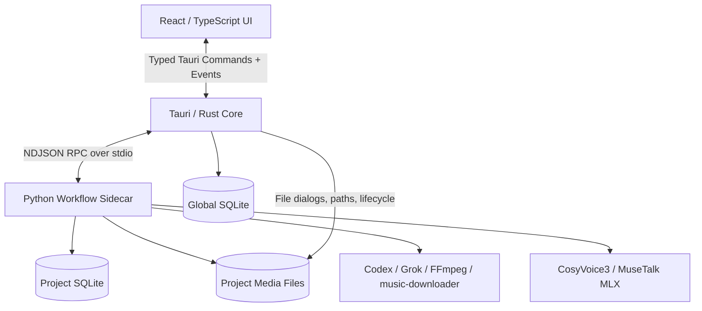
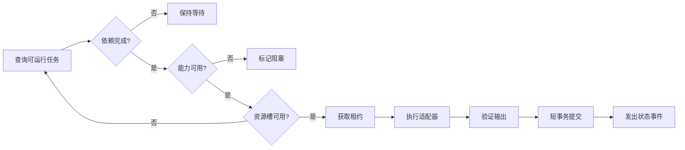
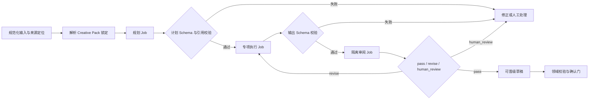

# AI 短视频漫剧工作站技术架构方案

> 文档状态：初稿  
> 对应文档：[PRD](./PRD.md) · [领域模型](./DOMAIN_MODEL.md)  
> 技术基线：macOS · Tauri 2 · React · TypeScript · Rust · Python sidecar · SQLite · FFmpeg  
> 最后更新：2026-07-22

## 1. 架构目标

V1 架构需要同时满足：

1. 在 macOS 上可靠调用本机 CLI 和本地模型。
2. 支持 50～80 集项目的长期运行、断点恢复和局部返工。
3. 将 UI、系统权限、业务工作流和生成工具隔离，避免彼此绑定。
4. 允许未来替换 Grok、TTS、口型和其他媒体能力。
5. 保证项目文件可迁移，不依赖当前电脑的绝对路径。
6. 在 M3 Pro 18GB 的资源约束下控制并发和代理渲染。
7. 默认不产生付费 API 调用，不自动删除任何用户文件。

## 2. 总体架构



架构采用四层：

| 层 | 技术 | 主要职责 |
|---|---|---|
| 展示层 | React + TypeScript | 工作台、分镜墙、审核、时间线、任务状态 |
| 桌面核心 | Tauri + Rust | 系统边界、窗口、文件选择、sidecar 生命周期、全局配置 |
| 业务与编排 | Python sidecar | 领域服务、项目数据库、任务队列、能力适配器、质检 |
| 工具与媒体 | CLI / 本地模型 | 实际文本、图片、视频、音频和渲染工作 |

## 3. 核心架构决策

### 3.1 Tauri WebView 不直接调用任意 CLI

React 不能获得通用 Shell 权限。所有系统操作通过类型化 Tauri command 请求 Rust；Rust 只允许启动随应用打包的 Python sidecar 和明确批准的系统动作。

外部生成 CLI 由 Python 适配器按白名单定义调用。这样避免前端字符串直接拼接成命令，也避免给 WebView 开放过宽的 `shell` 权限。

### 3.2 Python sidecar 是项目业务的唯一写入者

项目 SQLite 只由 Python sidecar 写入。Rust 和 React 不直接打开项目数据库，避免跨语言多写入者带来的事务、迁移和锁竞争问题。

Rust 可以维护一个独立的全局数据库，用于最近项目、窗口偏好、组件安装状态和应用级设置。全局库不得存储项目业务数据。

### 3.3 Rust 与 Python 使用 stdio RPC

V1 不在本机开放 HTTP 端口。Rust 启动长驻 sidecar，通过 stdin/stdout 传输 NDJSON 消息：一行一个 JSON 对象。

优点：

- 无端口冲突和防火墙提示。
- sidecar 生命周期天然从属于桌面应用。
- 不对本机网络暴露服务。
- 日志可独立走 stderr，不污染 RPC 流。

### 3.4 长任务不绑定单次 RPC

任何预计超过 2 秒的工作都创建持久化 `Job`。RPC 只负责提交任务并立即返回 `job_id`；进度通过事件推送和数据库查询获得。关闭窗口不会取消任务，退出应用时由用户选择继续收尾或安全暂停。

### 3.5 媒体文件不经过 IPC

IPC 只传稳定 ID、相对路径、元数据和短文本。图片、音频、视频和大型 JSON 写入项目目录，避免 Base64 或大消息阻塞 Tauri 事件通道。

### 3.6 组件运行时与应用包分离

应用包包含核心 Python sidecar；CosyVoice3、MuseTalk、模型权重和大体积运行环境作为可管理组件安装到用户应用数据目录。项目只引用组件能力与版本，不引用安装绝对路径。

## 4. 进程模型

### 4.1 进程树

```text
Tauri 主进程
├── WebView / React UI
└── workflow-sidecar
    ├── job worker: lightweight
    ├── job worker: media
    ├── codex CLI
    ├── grok CLI
    ├── ffmpeg / ffprobe
    ├── music-downloader
    ├── CosyVoice3 runtime
    └── MuseTalk MLX runtime
```

V1 使用一个 sidecar 主进程和受控子进程，不引入独立常驻守护程序。任务并发由 sidecar 内部调度器控制。

### 4.2 Sidecar 生命周期

1. Rust 启动 sidecar，传入协议版本、应用数据目录和日志目录。
2. sidecar 返回 `hello`，包含 sidecar 版本、协议版本和数据库兼容范围。
3. Rust 完成握手后允许 UI 打开项目。
4. Rust 每隔固定时间发送心跳；sidecar 同时报告队列和资源摘要。
5. sidecar 异常退出时，Rust 保存退出信息并有限次数重启。
6. 重启后 sidecar 回收过期任务租约，恢复安全任务。
7. 正常退出时，sidecar 停止接收新任务、提交数据库事务并释放子进程。

### 4.3 崩溃恢复

- `running` 任务持有有期限租约。
- sidecar 崩溃后，过期任务转回 `queued` 或 `retry_wait`。
- 有外部副作用的任务必须使用幂等键和输出文件校验。
- FFmpeg 等写文件任务先写临时路径，成功后原子重命名。
- CLI 返回成功但应用未记录时，恢复流程扫描生成清单和暂存目录进行对账。

## 5. Rust 桌面核心

### 5.1 职责

- 创建窗口、菜单、通知和文件选择器。
- 启动、监控和停止 Python sidecar。
- 实现 React 到 sidecar 的 RPC 代理。
- 管理全局应用数据库。
- 管理最近项目和项目目录授权。
- 验证用户选择的项目根目录。
- 处理应用退出、休眠、唤醒和更新生命周期。
- 向 UI 提供设备、磁盘和组件状态摘要。

### 5.2 不承担的职责

- 不实现剧情、分镜和连续性业务规则。
- 不直接执行模型提示词。
- 不写项目 SQLite。
- 不直接拼接外部 CLI 参数。
- 不保存项目媒体内容。

### 5.3 Tauri command 分组

| 命令域 | 示例 |
|---|---|
| `app` | 获取版本、退出准备、打开日志目录 |
| `project` | 选择目录、打开、关闭、最近项目 |
| `rpc` | 发送业务 RPC、取消请求 |
| `component` | 检查、安装、移除、打开组件目录 |
| `system` | 磁盘容量、休眠状态、通知 |

前端不得获得通用 `execute(command, args)` 命令。

### 5.4 Tauri 权限策略

- 主窗口只启用明确所需的 command。
- 文件访问默认限制到应用数据目录和用户已选项目目录。
- sidecar 只允许固定名称的打包二进制。
- 不向 WebView 开放任意 Shell 执行。
- 外部 URL 只通过白名单协议打开。
- 开发能力与生产能力配置分离。

Tauri 2 的 sidecar 需要在 `externalBin` 中声明，并以目标架构后缀打包；Shell 与文件访问都应通过 capability scope 显式授权。参考：[Tauri sidecar](https://v2.tauri.app/zh-cn/develop/sidecar/) · [Command scopes](https://v2.tauri.app/security/scope/) · [File system scopes](https://v2.tauri.app/plugin/file-system/)

## 6. React 前端

### 6.1 前端边界

前端负责交互状态，不保存业务事实。刷新 WebView 后，所有项目状态从 sidecar 重新加载。

前端可保存：

- 当前路由和展开状态。
- 临时表单输入。
- 未提交编辑缓冲区。
- 列表筛选、排序和视图偏好。

前端不能作为唯一来源保存：

- 审核结果。
- 任务状态。
- 当前正式修订。
- 资产选择。
- 时间线正式版本。

### 6.2 推荐前端结构

```text
src/
├── app/              # 启动、路由、全局 providers
├── features/         # 按业务工作区切片
│   ├── project/
│   ├── story/
│   ├── bible/
│   ├── episode/
│   ├── jobs/
│   ├── library/
│   └── delivery/
├── entities/         # 领域对象视图模型
├── shared/
│   ├── api/          # 生成的 RPC 客户端与类型
│   ├── ui/
│   ├── hooks/
│   └── media/
└── timeline/         # 时间线渲染和交互内核
```

### 6.3 状态管理

- 服务端/项目状态：查询缓存层，按事件失效并重新获取。
- UI 状态：轻量本地 store。
- 表单：显式草稿与提交，不能边输入边创建正式修订。
- 时间线：内存编辑模型 + 操作命令栈；保存时一次提交新修订。

具体库在实现阶段选型，领域契约不依赖某个前端状态库。

### 6.4 大列表与媒体预览

- 分镜墙和素材库使用虚拟列表。
- 视频默认加载代理文件和缩略图。
- 波形与缩略图由后台任务预生成。
- 列表接口采用游标分页，不一次加载整季全部媒体元数据。
- 项目事件只推送变更 ID，不推送完整大对象。

### 6.5 单集生产工作区边界

M3 正式实现前先用固定 30 镜头数据构建 2～3 天交互原型，对画布、列表/分栏和混合布局进行同任务对比。原型记录镜头定位、批量选择、资产替换、异常跳转和重排的完成时间、操作步数与误操作，不预设画布一定胜出。

候选布局需让上述五项任务的中位完成时间或操作步数至少一项较列表基线改善 20%，且无阻断性误操作；否则正式实现采用列表/分栏基线。

无论最终采用哪种布局，都遵守以下边界：

- UI 只消费 sidecar 提供的 `EpisodeProductionView` 投影，不建立第二套镜头、资产、任务或异常关系。
- 拖拽、替换、批量操作转换为类型化应用命令；前端不直接写数据库或自行计算正式依赖图。
- 命令成功后以返回的新修订 ID 和事件刷新投影；乐观状态失败时必须回滚。
- 30 镜头首屏只加载摘要、缩略图和当前视口详情，原始媒体按需加载。
- 原型代码默认可丢弃；只有通过效率基线的交互模式和可复用组件进入正式实现。

## 7. Python sidecar

### 7.1 内部模块

```text
workflow_sidecar/
├── rpc/               # 协议、请求处理、事件输出
├── application/       # 用例服务与事务边界
├── domain/            # 聚合、值对象、规则和状态机
├── persistence/       # SQLite、迁移、仓储
├── ingestion/         # 来源规范化、章节切分、定位与事件抽取
├── creative_packs/    # 注册、组合解析、锁定与评测
├── generation/        # 规划、执行、隔离审阅与草稿晋级
├── jobs/              # 调度、worker、租约、重试
├── dependencies/      # 依赖图与过期传播
├── adapters/          # 能力适配器
├── media/             # FFmpeg、探测、代理、渲染
├── quality/           # 自动检查和审核项
├── components/        # 模型/运行时检测
└── diagnostics/       # 日志、脱敏、诊断包
```

### 7.2 分层规则

- `domain` 不导入 CLI、SQLite、Tauri 或具体模型 SDK。
- `application` 组织用例和事务，不拼接命令行。
- `ingestion` 只产生来源片段、定位和事件草稿，不直接提交故事包。
- `creative_packs` 负责确定性组合解析和评测门禁，不调用 UI。
- `generation` 编排三阶段运行，但执行能力仍通过 `adapters` 端口获得。
- `adapters` 实现能力端口，可以调用外部工具。
- `persistence` 只实现仓储和迁移。
- `rpc` 只做协议转换和鉴权，不包含业务规则。

### 7.3 同步与异步

- 短查询和编辑提交通过同步用例完成。
- 生成、分析、下载、代理、质检和渲染全部进入任务队列。
- SQLite 写事务保持短小，不在事务中等待 CLI 或模型。
- 任务输出先落盘并验证，再用短事务登记。

## 8. IPC 协议

### 8.1 消息格式

使用带版本的 NDJSON envelope：

```json
{"v":1,"type":"request","id":"req_01","method":"episode.get","params":{"episode_id":"..."}}
{"v":1,"type":"response","id":"req_01","result":{"episode":{}}}
{"v":1,"type":"event","event":"job.updated","data":{"job_id":"...","status":"running"}}
```

stderr 只输出结构化日志，不得写入 stdout。任何工具的 stdout 先由适配器消费，不能直接透传到 sidecar stdout。

### 8.2 协议规则

- 所有消息包含协议版本。
- 请求 ID 在单次应用会话中唯一。
- 请求参数和响应结果使用 JSON Schema 校验。
- 错误使用稳定错误码、用户消息和可选诊断 ID。
- 未知字段向前兼容保留，未知方法明确拒绝。
- 单条消息设置大小上限；大型内容通过文件引用传递。

### 8.3 事件语义

事件是“状态已变化”的通知，不是唯一事实源。UI 丢失事件后可通过查询恢复。

主要事件：

- `project.changed`
- `episode.changed`
- `production_item.changed`
- `job.updated`
- `review.created`
- `asset.changed`
- `deliverable.updated`
- `capability.changed`
- `disk.warning`

### 8.4 取消语义

- 取消 RPC 请求只停止尚未完成的短查询。
- 取消长任务调用 `job.cancel`。
- 对无法即时终止的 CLI，先标记 `cancelling`，再发送软终止，超时后升级终止。
- 已生成的完整文件作为未采用候选保留，不自动删除。

## 9. 数据架构

### 9.1 数据库划分

```text
~/Library/Application Support/<App>/global.db
<project-root>/project.db
```

`global.db` 保存：

- 最近项目与显示名称。
- 全局设置和 UI 偏好。
- 适配器安装发现结果。
- 组件版本和健康状态。
- 全局素材库索引。
- 内置与全局 Creative Pack 注册表、不可变修订索引和评测套件。

`project.db` 保存领域模型中定义的项目业务表，包括故事来源切分、事件图谱、Creative Pack 锁定快照、评测结果和 AI 生成运行记录。项目锁定全局 Creative Pack 时，将被引用修订、解析后规则与资源哈希复制为项目内不可变快照；运行时不得依赖 `global.db` 中可变化的“最新版本”。

### 9.2 SQLite 模式

- 启用外键。
- 使用 WAL 模式。
- 设置合理的 busy timeout。
- 单 sidecar 进程持有连接池。
- 写事务串行化，读查询允许有限并发。
- 定期 checkpoint，但不在重型媒体任务关键路径中强制执行。

### 9.3 迁移

1. 打开项目时读取 schema 版本。
2. 若需要迁移，先创建轻量快照。
3. 在排他项目会话中执行递增迁移。
4. 迁移失败时回滚并保持旧库可用。
5. 新版项目被旧应用打开时只读展示兼容提示。

### 9.4 仓储边界

- 仓储按聚合提供，不暴露任意 SQL 给 RPC。
- 列表使用专门 read model，避免加载完整聚合。
- 复杂仪表盘数据允许使用投影表或物化摘要。
- 依赖图、队列和审核使用针对性索引。

## 10. 项目文件系统

### 10.1 推荐目录

```text
<project-root>/
├── project.db
├── project.json
├── .env.local
├── sources/
│   └── normalized/     # 规范化原文与切分批次清单
├── creative-packs/     # 项目锁定的模板和资源快照
├── assets/
│   ├── images/
│   ├── videos/
│   ├── audio/
│   ├── subtitles/
│   └── documents/
├── proxies/
├── renders/
│   ├── previews/
│   ├── masters/
│   └── platforms/
├── snapshots/
├── temp/
├── logs/
└── manifests/
```

`.env.local`、`temp` 和本地日志不进入标准项目导出包。

### 10.2 文件提交协议

1. 为任务创建唯一暂存目录。
2. 外部 CLI 只能写入该目录或明确输出文件。
3. 完成后使用 FFprobe、MIME、尺寸、时长和哈希校验。
4. 将文件原子移动到最终目录。
5. 在数据库事务中登记 `AssetFile` 和生成清单。
6. 事务失败则留下有标记的孤儿文件，等待人工清理建议。

### 10.3 路径安全

- 项目数据库只保存相对路径。
- 解析后路径必须仍位于项目根目录或批准的外置媒体根目录。
- 禁止 `..` 越界和未批准符号链接跳转。
- CLI 参数使用参数数组调用，不经过 Shell 字符串解释。
- 用户输入不能决定可执行文件路径。

### 10.4 全局资产引用

V1 使用“导入项目”策略：全局资产被项目采用时，在项目中创建业务引用，并根据设置硬链接或复制文件。若外置磁盘或文件系统不支持硬链接则复制。项目不能依赖全局库中可被移动的裸路径。

## 11. 环境变量与配置

### 11.1 解析优先级

`项目 .env.local → 应用全局 env 文件 → sidecar 进程环境变量`

合并由 sidecar 完成，得到任务级不可变环境快照。任务运行中配置变化不影响正在执行的进程。

### 11.2 安全规则

- `.env.local` 不进入快照、导出或诊断包。
- 只向适配器传入其声明需要的变量。
- 不把整个父进程环境无差别传给插件。
- 日志先脱敏再落盘。
- UI 只显示变量名、来源层级和是否已设置，不回显完整值。
- 子进程命令摘要中的敏感参数替换为占位符。

### 11.3 配置类型

- 非秘密项目配置进入数据库。
- 秘密值进入环境变量。
- 本机绝对路径进入全局设备配置。
- 插件配置使用版本化 Schema。

## 12. 任务执行架构

### 12.1 调度循环



### 12.2 Worker 类别

| 类别 | 默认并发 | 示例 |
|---|---:|---|
| 轻量 IO | 4 | 元数据、文件哈希、短查询 |
| 文本 CLI | 1/工具 | Codex、Grok 结构化输出 |
| 图片/视频 CLI | 1/工具 | Grok 媒体任务 |
| 本地模型 | 1 | CosyVoice3、MuseTalk |
| FFmpeg 代理 | 2 | 缩略图、波形、代理 |
| FFmpeg 最终渲染 | 1 | 粗剪、母版、平台版本 |

这是 M3 Pro 18GB 的保守默认值，实际并发可通过资源探测调整。

### 12.3 优先级

优先级从高到低：

1. 用户正在等待的短预览与显式操作。
2. 当前审核剧集的修复任务。
3. 当前日生产批次。
4. 后续剧集预生成。
5. 代理、索引和非关键维护。

### 12.4 重试

- 确定性输入错误不重试。
- 登录、额度、能力缺失进入 `blocked`。
- 网络或临时 CLI 错误指数退避。
- 输出 Schema 失败允许有限次纠正提示。
- 媒体质检失败不自动无限重生成。
- 每次重试创建独立 `JobAttempt` 和生成清单。

### 12.5 统一 AI 生成流水线

所有结构化 AI 生成统一经过“规划 → 执行 → 审阅”，领域用例不能直接调用文本适配器并写入正式修订：



关键约束：

- 三个阶段是同一 `GenerationRun` 下的独立持久任务，分别保存输入输出和迭代号。
- 执行与审阅不得共享对话上下文；可以使用同一适配器，但必须是独立调用，审阅输入显式包含计划、输出和校验规则。
- 计划和执行输入都包含来源定位、领域修订哈希与 Creative Pack 锁定哈希。
- 确定性 Schema、引用和业务规则先于 AI 审阅执行；AI 审阅不能把无效结构判为通过。
- `revise` 只创建新迭代，不覆盖旧输出；超过项目迭代上限后转 `human_review`，不得无限循环。
- 流水线通过只产生可晋级草稿，正式修订仍由领域服务和现有确认门控制。

## 13. 能力适配器架构

### 13.1 适配器接口

每个适配器实现：

- `describe()`：版本、能力和输入输出 Schema。
- `probe()`：安装、登录、模型和功能探测。
- `estimate()`：预计时间、磁盘和付费属性。
- `prepare()`：解析配置、环境和输入资产。
- `execute()`：运行并流式报告进度。
- `validate()`：验证输出文件和结构。
- `cancel()`：尽力终止当前执行。
- `diagnose()`：生成脱敏诊断结果。

“规划—执行—审阅”是主机侧工作流编排，不新增 AWAP 方法，也不把业务状态机下放给适配器。三个阶段分别通过现有能力请求独立执行；`generation_run_id`、阶段和迭代由主机任务与生成清单关联，因此 [适配器协议](./ADAPTER_PROTOCOL.md) 无需为该流水线增加专用协议分支。

### 13.2 执行安全

- 可执行文件来自设备级发现或内置组件，不来自项目文本。
- 参数按数组传递。
- 工作目录限制到任务暂存目录。
- 每个适配器声明允许读取的输入文件和允许写入的输出目录。
- 超时、最大输出、并发和环境变量均有限制。
- stdout/stderr 单独保存并限制文件大小。

### 13.3 内置适配器边界

#### Codex

- 文本推理、结构化内容和检查建议。
- 只使用非交互执行模式。
- 不授予项目外写权限。

#### Grok

- 文本、图片和视频能力均需独立探测。
- 图片/视频成功标准是文件落盘并通过媒体验证。
- 若某项能力探测失败，不影响其他 Grok 能力。

#### FFmpeg/FFprobe

- 使用预定义操作构建器，不接受任意滤镜字符串直接从 UI 透传。
- 最终命令和版本写入生成清单。

#### CosyVoice3

- 作为托管本地组件运行。
- 优先复用已加载模型，空闲超时后释放。
- 声音参考必须绑定授权记录。

#### MuseTalk 1.5 MLX

- 只处理分级策略标记为 `precise` 的镜头。
- 输入视频先标准化帧率、尺寸和音频格式。
- 输出失败时降级为简化口型任务。

#### music-downloader

- 以受控脚本适配器调用。
- 输出先进入导入暂存区。
- 创建来源记录和待确认授权记录。
- 用户确认后才能用于发布母版。

### 13.4 插件机制

V1 插件是本地 Python 包或可执行适配器，不运行第三方 Python 代码于 sidecar 主解释器：

- 每个插件独立子进程。
- 使用相同 NDJSON 能力协议。
- 清单声明能力、可执行入口、环境变量和文件权限。
- 安装前显示权限摘要。
- 崩溃只影响当前任务。

## 14. 依赖图与局部返工

### 14.1 输入指纹

每个下游产物保存规范化输入指纹：

```text
hash(
  upstream revision hashes
  + source span and source content hashes
  + creative pack lock hash
  + selected asset hashes
  + adapter/model identity
  + normalized parameters
  + prompt template revision
)
```

### 14.2 过期传播

1. 新正式修订提交后定位直接下游边。
2. 比较边记录输入哈希与当前上游哈希。
3. 不一致则标记直接下游 `stale`。
4. 继续遍历其下游，但不创建重生成任务。
5. 锁定资产保持可用，同时显示“依赖已变化”警告。
6. 用户选择接受旧结果、局部重生成或回退上游。

### 14.3 批量控制

- 单次修改先显示预计影响的集数、镜头、音频和导出物。
- 传播在数据库事务中分批执行，避免长时间锁库。
- 每批使用同一个 `impact_analysis_id`，支持中断恢复。
- UI 展示直接影响与间接影响，不只显示总数。

## 15. 媒体处理架构

### 15.1 代理策略

- 图片生成缩略图和屏幕预览版。
- 视频生成低码率代理、关键帧缩略图和音频波形。
- 原始文件只在最终渲染和像素检查时读取。
- 代理是可清理建议项，但永不自动删除。

### 15.2 非破坏性时间线

时间线保存素材引用和参数。预览渲染器将时间线编译为受控 FFmpeg 执行计划；最终渲染重新读取源素材，不从代理导出。

### 15.3 渲染计划

```text
Timeline Revision
→ validate referenced assets
→ resolve platform overrides
→ compile clips and filters
→ render video layers
→ mix voice/music/sfx
→ render captions and overlays
→ mux and validate
→ register Deliverable
```

### 15.4 字幕

- 内部使用结构化字幕段与逐字时间。
- 导出阶段生成 ASS 中间文件。
- 字体作为项目依赖记录并进行可用性检查。
- 预览和最终渲染使用同一字幕编译器。

### 15.5 音频

- 内部音频统一到约定采样率和声道布局。
- 原始音频保留，标准化版本作为派生资产。
- 混音计划保存响度目标、对白优先级和音乐侧链规则。
- 平台派生版本只调整导出配置，不重新生成配音。

## 16. 自动质检架构

质检采用可组合规则：

1. 确定性规则：文件、尺寸、时长、画幅、静音、字幕越界。
2. 媒体分析：黑帧、冻结帧、响度、音画长度。
3. AI 辅助检查：角色、服装、场景、道具和明显视觉异常。
4. 跨镜头检查：连续性快照、前后镜头状态与重复度。

AI 质检输出只创建 `QualityFinding`，不能直接替换资产。规则集版本写入每次检查记录。

## 17. 可观测性与诊断

### 17.1 日志

- Rust、sidecar、任务和外部 CLI 使用统一关联 ID。
- 日志采用 JSON Lines，按日期和大小轮转。
- 项目日志与全局应用日志分离。
- 日志写入前执行密钥、Cookie、Token 和敏感路径脱敏。
- 默认不上传。

### 17.2 指标

本地记录：

- 任务成功率和错误分类。
- 每种能力耗时。
- 队列等待时间。
- 人工介入次数。
- 单集生成和渲染时间。
- 磁盘增长速度。

指标仅用于本地仪表盘，不实现远程遥测。

### 17.3 诊断包

包含应用版本、组件版本、脱敏日志、任务摘要、能力探测和数据库 Schema 版本；不包含 `.env.local`、完整提示词、媒体原文件或声音样本，除非用户逐项选择。

## 18. 安全模型

### 18.1 信任边界

- React/WebView：不可信展示层。
- Rust：本机权限与进程信任边界。
- 核心 Python sidecar：受信业务进程。
- 第三方 CLI/插件：受限外部进程。
- 项目输入和下载素材：不可信数据。

### 18.2 主要威胁与控制

| 威胁 | 控制 |
|---|---|
| 命令注入 | 参数数组、可执行白名单、禁止 UI 透传 Shell |
| 路径穿越 | 规范化路径、根目录校验、符号链接检查 |
| 秘密泄露 | 最小环境注入、日志脱敏、导出排除 |
| 恶意插件 | 独立进程、权限清单、资源和路径限制 |
| 大文件耗尽磁盘 | 预估、告警、任务前空间检查、人工清理 |
| 下载文件伪装 | MIME、媒体探测、扩展名与内容一致性检查 |
| 数据库损坏 | WAL、事务、迁移前快照、完整性检查 |
| 失控付费 | 付费标记、预算授权、调度前硬检查 |

### 18.3 macOS 注意事项

- 应用和 sidecar 需要签名、公证并保持签名链一致。
- 组件下载后校验哈希和来源。
- 访问用户选择的项目目录应使用明确的用户动作和持久化授权策略。
- 生产构建不启用调试 WebView 或远程开发端口。

## 19. 组件管理

### 19.1 组件类型

- 应用内置：核心 sidecar、基础 Schema 和迁移。
- 系统发现：Codex、Grok、FFmpeg、FFprobe、`music-downloader` 依赖。
- 应用管理：CosyVoice3、MuseTalk MLX、模型权重和专用运行时。

### 19.2 安装状态

`not_installed → downloading → verifying → installing → ready`

异常状态：`failed`、`incompatible`、`update_available`、`disabled`。

### 19.3 更新策略

- 应用更新与模型组件更新分开。
- 更新前检查当前项目是否有运行任务。
- sidecar 协议与数据库版本在启动握手时校验。
- 组件更新不删除旧版本；切换成功并经用户确认后，旧版本进入清理建议。
- V1 自动检查更新，但安装由用户确认。

Tauri 提供官方 updater 插件，但正式发布前仍需确定签名、更新源和回滚策略。参考：[Tauri updater](https://v2.tauri.app/reference/javascript/updater/)

## 20. 打包与发布

### 20.1 Python sidecar 打包

Tauri 官方支持将任意语言二进制作为 sidecar，并明确列出 PyInstaller 打包 Python 应用的场景。V1 将核心 Python sidecar 打包为 Apple Silicon 可执行文件，文件名带 Tauri 目标三元组后缀。

模型环境不直接塞入 sidecar 可执行文件，以免应用包巨大且难以独立升级。

### 20.2 架构范围

V1 正式支持 `aarch64-apple-darwin`。是否支持 Intel Mac 不属于 V1 目标。构建流水线必须拒绝缺少对应 sidecar 的目标架构。

### 20.3 发布产物

- 签名并公证的 macOS 安装包。
- 应用更新清单与签名。
- 组件清单、版本、下载地址和哈希。
- 数据库与 IPC 协议兼容矩阵。

## 21. 测试策略

用户已明确不需要系统自动判定生成模型的最终艺术质量，但软件正确性仍需要验证。Creative Pack 固定样例评测只自动检查 Schema、规则遵从、资源完整性和相对退化；视觉主观分由用户记录，不能作为自动艺术裁决。

### 21.1 单元测试

- 领域状态机和业务不变量。
- 设置继承与锁定规则。
- 输入指纹和过期传播。
- 来源文本规范化、切分偏移与 `SourceSpan` 哈希校验。
- 事件边约束、Creative Pack 组合冲突解析与锁定哈希。
- AI 三阶段状态机、迭代上限和草稿晋级门禁。
- 路径规范化和环境脱敏。
- 适配器参数构建和输出解析。

### 21.2 集成测试

- Rust ↔ sidecar IPC。
- SQLite 迁移、事务和崩溃恢复。
- 任务租约、重试、取消和恢复。
- FFmpeg 代理与非破坏性渲染。
- 临时文件原子提交和孤儿对账。
- 付费路由阻断和授权门禁。
- Creative Pack 全局修订导入项目后的离线复现。
- 规划、执行或审阅任一阶段崩溃后的恢复与幂等重放。

### 21.3 端到端测试

- 创建项目到导出模拟成片。
- 修改角色设定后只标记相关下游过期。
- 应用重启后恢复任务。
- 外置媒体磁盘离线再上线。
- 未确认音乐无法进入发布母版。
- 修改来源文本后只将相关定位、事件与派生草稿标记为过期。
- 审阅未通过的 AI 输出无法成为正式故事、设定或分镜修订。

真实 Grok、CosyVoice3 和 MuseTalk 的效果由用户人工验收；自动测试使用假适配器验证流程。

## 22. 性能预算

### 22.1 交互预算

- 普通页面首次项目查询：目标 500ms 内返回首屏。
- 编辑提交：目标 300ms 内完成数据库事务。
- 任务操作反馈：目标 100ms 内显示本地乐观状态，随后以服务端状态校正。
- 分镜墙滚动不加载原始视频。
- 30 镜头单集工作区首次摘要加载目标不超过 1 秒，视口内操作反馈目标不超过 100ms。

### 22.2 资源预算

- UI + Rust +空闲 sidecar 不加载重型模型。
- CosyVoice3 和 MuseTalk 默认不并发常驻。
- 最终渲染期间暂停新的本地模型重任务。
- 磁盘剩余空间低于项目估算阈值时阻止新批次并要求用户决定。

### 22.3 数据规模假设

按 80 集、每集 30 镜头估算至少 2400 个镜头槽位，并可能产生数倍候选与派生文件。所有核心列表和依赖传播不得假设数据可一次性加载到 UI。

## 23. 实施切片

### Slice 0：技术验证

- Tauri 启动 Python sidecar 并完成 stdio RPC。
- Grok/Codex CLI 非交互探测。
- Grok 图片、视频落盘验证。
- CosyVoice3 与 MuseTalk 在 M3 Pro 上验证。
- FFmpeg 代理与竖屏字幕验证。

### Slice 1：项目骨架

- 项目创建、打开、迁移和快照。
- 全局/项目数据库。
- 项目目录和环境变量解析。
- sidecar 监督与诊断。

### Slice 2：故事与圣经

- 剧情输入、章节切分、来源定位与事件图谱。
- Creative Pack 注册、组合、项目锁定和固定样例评测。
- 统一的规划、执行、隔离审阅与草稿晋级流水线。
- 分支、故事包、角色与场景包。
- 修订、草稿、Schema 校验和确认门。
- 连续性状态账本。

### Slice 3：分镜与生产

- 30 镜头单集生产工作区原型与布局决策记录。
- 分镜、镜头和导演预设。
- 任务队列、适配器、生成清单和候选选择。
- 依赖图和局部过期。

### Slice 4：后期与交付

- TTS、口型、字幕、音乐音效。
- 非破坏性时间线和粗剪。
- 自动质检、审核队列和确认门。
- 母版、抖音与红果导出。

## 24. 架构验收标准

1. React 无法直接执行任意系统命令。
2. Python sidecar 异常退出后可被检测并恢复。
3. 应用重启后持久任务不会丢失或重复产生正式资产。
4. 项目移动到新目录后仍能打开，数据库不含项目内部绝对路径。
5. 任一正式资产可追溯到输入修订、适配器和输出文件。
6. 修改上游只标记受影响下游，不自动重跑。
7. 未授权付费适配器无法被调度。
8. 未确认外部音乐无法进入发布母版。
9. 时间线操作不会覆盖源文件。
10. 无任何后台流程会自动删除用户文件。
11. 任一抽取事件可定位到未漂移的原文章节与文本区间。
12. 项目在全局 Creative Pack 更新或离线后仍能按锁定哈希复现规则集合。
13. 任一 AI 正式修订都能追溯到规划、执行、隔离审阅及 Creative Pack 锁定；审阅失败不能晋级。
14. 30 镜头工作区不保存独立业务事实，所有变更通过 sidecar 命令提交，并有画布、列表/分栏或混合布局的量化选择依据。

## 25. 技术验证与 ADR

独立 ADR 见 [`docs/adr/`](./adr/README.md)。M0 结论摘要：

1. **ADR-001：Rust 与 Python 的 stdio NDJSON RPC**——已验证（吞吐、取消、崩溃、日志隔离）。
2. **ADR-002：Python sidecar 打包方案**——已验证 PyInstaller onefile；签名包待复验。
3. **ADR-003：项目 SQLite 唯一写入者**——已决策；M1 实现 WAL/迁移/唯一写者。
4. **ADR-004：插件隔离级别**——已决策：独立进程 + 权限清单 + 环境白名单。
5. **ADR-005：全局资产导入策略**——已决策：硬链接优先、否则复制；项目相对路径。
6. **ADR-006：Grok 媒体能力适配**——文本/图/编辑 ready；视频 ZDR unavailable，降级关键帧动态。
7. **ADR-007：本地模型组件管理**——已决策；CosyVoice3/MuseTalk 本机未装，M4 前补齐。
8. **ADR-008：FFmpeg 时间线编译器**——竖屏混音软字幕 ready；硬烧录需 libass 构建。
