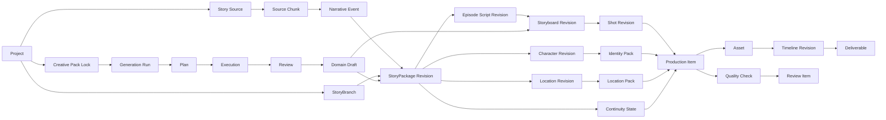

# AI 短视频漫剧工作站领域模型与数据结构设计

> 文档状态：初稿  
> 对应产品文档：[PRD](./PRD.md)  
> 设计范围：V1 领域边界、核心实体、状态机、依赖图与 SQLite 逻辑模型  
> 最后更新：2026-07-22

## 1. 设计目标

本设计将产品需求转化为稳定的业务概念和数据边界，重点解决四个问题：

1. 让 50～80 集连续剧的角色、场景和剧情状态可以被机器检查。
2. 让任何上游修改都能计算下游影响范围，而不是整季重新生成。
3. 让 AI 生成结果、人工修改、审核和回退都可追溯。
4. 让不同 CLI、模型和媒体工具通过统一能力模型参与生产。

本文定义逻辑数据模型，不锁定具体 ORM、迁移框架或进程通信协议。

## 2. 建模原则

### 2.1 稳定身份与可变版本分离

业务对象使用稳定 ID，例如同一个角色始终使用同一个 `character_id`。角色设定的每次修改保存为新的 `character_revision`，引用具体内容时必须引用修订版本，而不是只引用稳定 ID。

### 2.2 草稿、正式版本与派生产物分离

- 草稿允许不完整，不能进入生产链路。
- 正式版本必须通过结构校验并形成不可变修订。
- 派生产物保存其全部输入版本，不能依赖“当前最新版本”。

### 2.3 大文件与结构数据分离

- SQLite 保存结构、关系、状态、版本和相对路径。
- 图片、音频、视频、字幕和渲染文件保存在项目媒体目录。
- 媒体文件使用内容哈希识别和去重。

### 2.4 显式状态转换

项目、剧集、镜头、任务、审核项和导出物均使用显式状态机。业务状态不得只通过“某个字段是否为空”推断。

### 2.5 删除默认采用软删除

业务记录默认标记 `archived_at`，不物理删除。媒体文件清理由用户确认的独立操作执行，并保留审计记录。

### 2.6 人工决定高于自动结果

任何 AI 建议、自动评分或路由结果都可以被用户覆盖。覆盖行为必须记录原因和操作者来源 `human`。

## 3. 领域边界

系统划分为十个边界上下文：

| 边界 | 职责 | 核心聚合 |
|---|---|---|
| 项目 | 项目配置、阶段和平台目标 | Project |
| 创作配置 | Creative Pack 注册、组合、锁定与评测 | CreativePack、CreativePackCompositionRevision、ProjectCreativePackLock |
| 故事 | 故事来源、事件图谱、故事分支、故事圣经、分集剧本 | StorySource、NarrativeEvent、StoryBranch、StoryPackage、EpisodeScript |
| 连续性 | 角色、场景、道具和时间状态 | Character、Location、Prop、ContinuityState |
| 导演 | 视觉圣经、导演预设和分镜 | VisualBible、DirectorPreset、Storyboard |
| 资产 | 媒体文件、候选、复用和来源 | Asset、AssetCollection、LicenseRecord |
| 生产 | AI 生成运行、媒体生成请求、依赖、任务和路由 | GenerationRun、ProductionItem、DependencyEdge、Job |
| 后期 | 时间线、字幕、音频混合和封面 | Timeline、CaptionTrack、MixPlan、Cover |
| 质检 | 自动检查、异常和人工审核 | QualityCheck、ReviewItem、ApprovalGate |
| 交付 | 母版、平台版本和发布清单 | ExportProfile、Deliverable、PublishChecklist |

## 4. 核心关系总览



## 5. 通用字段与类型

### 5.1 标识符

- 所有业务主键使用 UUIDv7 字符串。
- 数据库列名统一为 `<entity>_id`。
- 外部工具 ID 只作为属性保存，不充当业务主键。

### 5.2 时间

- 所有系统时间使用 UTC ISO 8601，SQLite 中存为文本。
- 界面按用户当前时区显示。
- 故事内时间使用 `story_time`，与系统时间完全分离。

### 5.3 通用审计字段

大多数可修改实体包含：

| 字段 | 类型 | 含义 |
|---|---|---|
| `created_at` | datetime | 创建时间 |
| `updated_at` | datetime | 最近修改时间 |
| `archived_at` | datetime? | 软删除时间 |
| `created_by` | enum | `human`、`ai`、`system`、`import` |
| `source_job_id` | UUID? | 生成该记录的任务 |

### 5.4 修订字段

不可变修订实体包含：

| 字段 | 类型 | 含义 |
|---|---|---|
| `revision_id` | UUID | 当前修订 ID |
| `entity_id` | UUID | 稳定业务对象 ID |
| `revision_no` | integer | 单对象递增版本号 |
| `parent_revision_id` | UUID? | 直接父版本 |
| `branch_id` | UUID? | 所属故事分支 |
| `status` | enum | `draft`、`validated`、`approved`、`superseded` |
| `content_hash` | string | 规范化内容哈希 |
| `change_summary` | string? | 变更摘要 |

已进入生产或已确认的修订不得原地修改。

### 5.5 可扩展字段

能力差异大、仍处于快速变化中的数据可使用 JSON 字段，但必须满足：

- 核心查询字段不能只存在 JSON 中。
- JSON 必须带 `schema_version`。
- 读取时执行 Schema 校验。
- 未识别字段必须保留，避免插件往返时丢失。

## 6. 项目与创作配置领域

### 6.1 Project

`Project` 是根聚合，定义一部剧的生产边界。

| 字段 | 类型 | 说明 |
|---|---|---|
| `project_id` | UUID | 项目 ID |
| `name` | string | 项目名称 |
| `slug` | string | 项目目录安全名称 |
| `status` | enum | 项目状态 |
| `primary_branch_id` | UUID? | 当前生产主线 |
| `visual_bible_id` | UUID? | 当前视觉圣经 |
| `director_preset_id` | UUID? | 当前导演预设 |
| `target_episode_count_min` | integer | 默认 50 |
| `target_episode_count_max` | integer | 默认 80 |
| `target_duration_ms_min` | integer | 默认 90000 |
| `target_duration_ms_max` | integer | 默认 120000 |
| `aspect_ratio` | string | V1 固定 `9:16` |
| `language` | string | V1 默认 `zh-CN` |
| `project_root` | string | 应用配置中的项目目录引用 |
| `settings_json` | JSON | 可扩展项目设置 |

项目状态：

```text
draft → story_development → preproduction → production → postproduction
      → delivering → completed

任何非 completed 状态均可进入 paused
paused 可回到原状态
任何状态可 archived，但需人工确认
```

### 6.2 ProjectPlatformTarget

一个项目可包含多个发行目标。V1 默认创建 `douyin` 和 `hongguo`。

字段包括平台代码、启用状态、导出配置、字幕安全区、片头片尾规则和元数据模板引用。

### 6.3 ProjectSetting

设置按层级解析：

`系统默认 → 全局设置 → 项目设置 → 剧集覆盖 → 镜头覆盖`

设置记录使用 `namespace + key + scope_type + scope_id` 唯一约束。项目硬约束增加 `locked = true`，下级不得覆盖。

### 6.4 CreativePack 与 CreativePackRevision

`CreativePack` 是可注册、复用和版本化的创作规则组件。一个组件只属于一种类型：

- `visual_style`：人物比例、画面语言、色彩、光影、允许和禁用元素。
- `narrative_genre`：题材惯例、节奏、冲突、钩子、人物弧线和内容边界。
- `model_technique`：面向具体能力的提示模板、参考资产策略、参数约束和降级建议。

稳定记录保存名称、类型、作用域 `builtin/global/project`、所有者和归档状态；不可变 `CreativePackRevision` 保存带版本的规则、资源引用、输入输出 Schema、兼容能力范围和 `content_hash`。已发布修订不得原地修改。

### 6.5 CreativePackCompositionRevision

组合修订将一个视觉风格、一个叙事题材和一个或多个模型技法修订解析为可执行规则集合，并保存：

| 字段 | 类型 | 说明 |
|---|---|---|
| `composition_revision_id` | UUID | 组合修订 ID |
| `component_revision_ids` | relation | 被组合的组件修订 |
| `resolution_order_json` | JSON | 冲突解析顺序 |
| `resolved_rules_json` | JSON | 规范化后的最终规则 |
| `resource_hashes_json` | JSON | 引用模板和资源的内容哈希 |
| `content_hash` | string | 组件、顺序、规则和资源的总哈希 |
| `status` | enum | `draft`、`evaluating`、`eligible`、`rejected`、`deprecated` |

组合发生硬规则冲突、引用资源缺失或 Schema 不兼容时不得进入 `eligible`。

### 6.6 ProjectCreativePackLock

项目只能通过锁定记录使用 Creative Pack 组合，不能引用“最新版本”。锁定记录包含项目、组合修订、组合内容哈希、用途范围、锁定时间和操作者。项目更换组合必须创建新锁定记录并运行影响分析；已有生成记录继续引用旧锁定。

### 6.7 CreativePackEvaluation

每次评测引用固定的 `evaluation_suite_revision_id`、组合修订和实际适配器，保存逐用例结构校验、规则遵从、人工评分、基线差异和最终结论。评测只决定修订是否具备成为默认版本的资格，不自动修改项目锁定或替换已确认版本。

## 7. 故事领域

### 7.1 StorySource

记录原始输入，支持：

- `idea`
- `novel`
- `season_outline`
- `episode_scripts`
- `mixed`

保存原始文件资产、输入文本、解析状态和来源信息。原始输入不可被后续 AI 改写覆盖。

#### 7.1.1 StorySourceChunk

长文本导入后先生成可重建的章节与片段层级。片段至少保存：

| 字段 | 类型 | 说明 |
|---|---|---|
| `source_chunk_id` | UUID | 片段 ID |
| `story_source_id` | UUID | 原始来源 |
| `parent_chunk_id` | UUID? | 上级卷、章或节 |
| `chunk_type` | enum | `volume`、`chapter`、`section`、`window` |
| `ordinal` | integer | 同级顺序 |
| `title` | string? | 原章节标题 |
| `char_start` / `char_end` | integer | 规范化原文中的半开区间 `[start, end)` |
| `content_hash` | string | 区间文本哈希 |

偏移基于换行规范化后的 Unicode 码点位置。切分策略升级可以生成新的切分批次，但不得修改原始来源文本或破坏旧定位。

#### 7.1.2 SourceSpan

`SourceSpan` 是结构化事实与原文之间的通用来源定位：

| 字段 | 类型 | 说明 |
|---|---|---|
| `source_span_id` | UUID | 定位 ID |
| `story_source_id` | UUID | 原始来源 |
| `source_chunk_id` | UUID | 所属最小片段 |
| `char_start` / `char_end` | integer | 原文半开区间 |
| `quote_hash` | string | 对应文本哈希，用于检测来源漂移 |
| `relation` | enum | `supports`、`contradicts`、`mentions`、`derived_from` |
| `target_type` / `target_id` | polymorphic ref | 被定位的事件、规则或修订 |

来源文本发生合法替换时，旧定位保持历史可读并标记 `stale`，新事实必须重新定位。创作性补充可以标记 `origin = creative` 而不引用原文，但不得被展示为来源事实。

#### 7.1.3 NarrativeEvent、NarrativeEventRevision 与事件关系

`NarrativeEvent` 保存稳定事件身份，`NarrativeEventRevision` 保存所属故事分支、标题、摘要、顺序键、故事时间、涉及场景、抽取置信度和状态。每个抽取事件修订至少引用一个有效 `SourceSpan`。

参与对象使用 `NarrativeEventParticipant` 表达，字段包括事件修订、对象类型 `character/location/prop/unresolved`、对象 ID、原文名称和角色 `actor/target/witness/context`。对象尚未正式建档时使用 `unresolved`，后续通过显式解析记录绑定，不能改写历史抽取结果。

事件图谱使用 `NarrativeEventEdge` 表达有向关系：

- `precedes`：明确顺序。
- `causes`：前一事件导致后一事件。
- `enables`：前一事件提供必要条件。
- `conflicts`：两条事件陈述不一致。
- `foreshadows`：前一事件为后一事件埋设线索。

边保存所属分支、两端事件修订、关系类型、置信度和证据 `SourceSpan`。`causes` 与 `enables` 不得仅凭文本顺序自动成立；低置信度边进入人工复核。

### 7.2 StoryBranch

| 字段 | 类型 | 说明 |
|---|---|---|
| `branch_id` | UUID | 分支 ID |
| `project_id` | UUID | 所属项目 |
| `name` | string | 分支名称 |
| `parent_branch_id` | UUID? | 来源分支 |
| `forked_from_revision_id` | UUID? | 分叉点 |
| `is_primary` | boolean | 是否为生产主线 |
| `status` | enum | `exploring`、`candidate`、`primary`、`archived` |

同一项目只能存在一个 `primary` 分支。只有主线的正式修订可以进入生产。

### 7.3 StoryPackageRevision

可生产故事包是故事领域的正式出口，包含：

- 故事定位与主题。
- 世界规则引用。
- 角色与关系修订引用。
- 整季剧情弧线。
- 故事时间线。
- 分集脚本修订清单。
- 连续性状态变更清单。

故事包不内嵌媒体提示词或镜头参数。

### 7.4 WorldRule

世界规则包含规则类别、规则文本、强制等级和生效范围。`hard` 规则冲突会阻断正式提交，`soft` 规则只产生警告。

### 7.5 Episode

`Episode` 是稳定容器，不直接保存剧本内容。

| 字段 | 类型 | 说明 |
|---|---|---|
| `episode_id` | UUID | 剧集 ID |
| `project_id` | UUID | 所属项目 |
| `episode_no` | integer | 集数，从 1 开始 |
| `title` | string? | 当前展示标题 |
| `status` | enum | 剧集生产状态 |
| `current_script_revision_id` | UUID? | 当前剧本修订 |
| `current_storyboard_revision_id` | UUID? | 当前分镜修订 |
| `current_timeline_revision_id` | UUID? | 当前时间线修订 |

`project_id + episode_no` 必须唯一。

剧集状态：

```text
planned → scripting → script_review → preproduction → generating
        → qc_review → rough_cut_review → approved → exported → published
```

辅助状态 `paused`、`blocked` 和 `archived` 需要保存进入前状态。

### 7.6 EpisodeScriptRevision

包含剧集目标、主要冲突、反转、开头钩子、结尾钩子、预计时长和有序场景列表。

### 7.7 ScriptSceneRevision

| 字段 | 类型 | 说明 |
|---|---|---|
| `scene_revision_id` | UUID | 场景修订 |
| `episode_script_revision_id` | UUID | 所属剧本修订 |
| `scene_no` | integer | 场景顺序 |
| `location_revision_id` | UUID | 场景设定版本 |
| `story_time_start` | string? | 故事内开始时间 |
| `time_of_day` | enum | 日夜等时间标签 |
| `purpose` | string | 场景叙事目的 |
| `action_text` | text | 动作描述 |
| `estimated_duration_ms` | integer | 预计时长 |

### 7.8 DialogueLineRevision

台词和旁白使用稳定 `line_id` 与不可变修订。字段包括说话角色、文本、类型、情绪、动作意图、发音覆盖、顺序和预计时长。

## 8. 连续性领域

### 8.1 Character 与 CharacterRevision

`Character` 表示稳定人物身份；`CharacterRevision` 保存姓名、年龄感、体型、外貌规则、性格、人物目标和不可变特征。

角色删除或合并不能破坏历史镜头引用。合并角色需要显式建立 `entity_alias`，不得直接改写旧外键。

### 8.2 CharacterRelationshipRevision

保存有方向的人物关系：来源角色、目标角色、关系类型、描述、故事时间有效区间和所属故事分支。

### 8.3 CharacterIdentityPackRevision

身份包包含：

- 多视角参考资产引用。
- 景别参考资产引用。
- 表情集引用。
- 服装集引用。
- 正向与负向提示词。
- 参考图优先级。
- 身高与比例。
- 声音档案引用。
- 确认状态。

身份包是生产镜头的强依赖。主要角色身份包未确认时，对应任务不能入队。

### 8.4 VoiceProfileRevision

| 字段 | 类型 | 说明 |
|---|---|---|
| `voice_profile_revision_id` | UUID | 声音档案修订 |
| `character_id` | UUID? | 角色引用，旁白可为空 |
| `engine_adapter_id` | UUID | 默认 TTS 适配器 |
| `voice_ref_asset_id` | UUID? | 授权参考音频 |
| `speaker_embedding_asset_id` | UUID? | 可保存的声音特征 |
| `speed` | number | 默认语速 |
| `emotion_range_json` | JSON | 允许情绪范围 |
| `pronunciation_rules_json` | JSON | 发音规则 |
| `authorization_record_id` | UUID? | 声音授权记录 |

### 8.5 Location 与 LocationPackRevision

场景包保存空间布局、方向轴、主视角、可用机位、出入口、家具与关键道具锚点、昼夜变体及参考资产。

### 8.6 Prop 与 PropRevision

关键道具拥有稳定身份、外观修订、持有人和状态。普通不可追踪布景不需要建模为 `Prop`。

### 8.7 ContinuityState

连续性状态使用有效时间区间表达，而不是覆盖当前值。

| 字段 | 类型 | 说明 |
|---|---|---|
| `continuity_state_id` | UUID | 状态记录 |
| `branch_id` | UUID | 所属故事分支 |
| `subject_type` | enum | `character`、`location`、`prop`、`relationship` |
| `subject_id` | UUID | 对象 ID |
| `state_key` | string | 如 `outfit`、`injury`、`owner` |
| `value_json` | JSON | 状态值与引用 |
| `story_time_from` | string | 生效时间 |
| `story_time_to` | string? | 失效时间 |
| `source_revision_id` | UUID | 来源剧情修订 |
| `priority` | integer | 冲突时优先级 |

同一分支、对象、状态键在同一故事时间不得出现未解决的同优先级重叠。

## 9. 导演领域

### 9.1 VisualBibleRevision

包含风格名称、人物比例、线条、上色、光影、服装、场景、色板、允许元素、禁用元素、参考资产和基础提示词模板。

视觉圣经的主版本变更会创建迁移影响分析，不自动使已锁定资产失效。

### 9.2 DirectorPresetRevision

包含景别分布、镜头时长、构图规则、运镜强度、转场频率、对话覆盖策略、色彩节奏、禁用手法和情绪子预设。

### 9.3 StoryboardRevision

一个分镜修订对应一个剧本修订，包含有序镜头修订列表及预计总时长。分镜通过确认门后才可批量生成。

### 9.4 Shot 与 ShotRevision

`Shot` 是稳定镜头槽位。修改镜头内容创建新修订，删除镜头则归档槽位。

| 字段 | 类型 | 说明 |
|---|---|---|
| `shot_id` | UUID | 稳定镜头 ID |
| `shot_revision_id` | UUID | 镜头修订 ID |
| `storyboard_revision_id` | UUID | 所属分镜 |
| `shot_no` | integer | 顺序 |
| `scene_revision_id` | UUID | 剧本场景 |
| `shot_type` | enum | 建立、对话、反应、动作、环境等 |
| `framing` | enum | 特写、近景、中景、全景等 |
| `camera_angle` | enum | 平视、俯视、仰视等 |
| `camera_motion_json` | JSON | 运镜参数 |
| `duration_ms` | integer | 镜头时长 |
| `character_revision_ids` | relation | 出镜角色版本 |
| `location_revision_id` | UUID | 场景版本 |
| `continuity_snapshot_id` | UUID | 状态快照 |
| `dialogue_line_revision_ids` | relation | 覆盖台词版本 |
| `generation_mode` | enum | `static_motion`、`image_to_video`、`reuse` |
| `lip_sync_level` | enum | `precise`、`simplified`、`none` |

### 9.5 ContinuitySnapshot

在镜头修订提交时，将该镜头故事时间点的有效连续性状态解析为不可变快照。生成任务引用快照，避免状态账本后来变化时无法解释旧结果。

## 10. 资产领域

### 10.1 Asset

`Asset` 表示一个可管理媒体对象；实际文件版本由 `AssetFile` 表示。

| 字段 | 类型 | 说明 |
|---|---|---|
| `asset_id` | UUID | 资产 ID |
| `project_id` | UUID? | 空值表示全局资产 |
| `asset_type` | enum | `image`、`video`、`audio`、`subtitle`、`document`、`font`、`other` |
| `role` | string | 如角色参考、背景、配音、音乐、成片 |
| `title` | string | 展示名称 |
| `status` | enum | 资产状态 |
| `selected_file_id` | UUID? | 当前采用文件 |
| `license_status` | enum | 授权状态 |
| `locked` | boolean | 是否锁定 |

资产状态：

`draft → candidate → selected → approved → archived`

`rejected` 可由 `candidate` 进入，但保留原文件和原因。

### 10.2 AssetFile

| 字段 | 类型 | 说明 |
|---|---|---|
| `asset_file_id` | UUID | 文件记录 |
| `asset_id` | UUID | 所属资产 |
| `relative_path` | string | 项目相对路径 |
| `content_hash` | string | SHA-256 |
| `byte_size` | integer | 文件大小 |
| `mime_type` | string | MIME 类型 |
| `width` / `height` | integer? | 图像/视频尺寸 |
| `duration_ms` | integer? | 音视频时长 |
| `codec_json` | JSON? | 编解码信息 |
| `is_proxy` | boolean | 是否代理文件 |
| `source_file_id` | UUID? | 代理或派生来源 |
| `availability` | enum | `online`、`missing`、`external_offline` |

`content_hash + byte_size` 用于文件去重，但不同业务语义的 `Asset` 可以引用同一个 `AssetFile`。

### 10.3 AssetLink

用显式关系将资产绑定到角色、场景、镜头、台词、时间线或导出物。字段包括 `owner_type`、`owner_id`、`asset_id`、`usage_role` 和顺序。

### 10.4 AssetCollection

支持全局/项目素材库、角色表情集、服装集、音乐库和音效库。集合可嵌套，但禁止循环引用。

### 10.5 SourceRecord

记录外部来源 URL、平台、标题、作者、获取工具、获取时间和原始元数据。`music-downloader` 导入必须创建此记录。

### 10.6 LicenseRecord

| 字段 | 类型 | 说明 |
|---|---|---|
| `license_record_id` | UUID | 授权记录 |
| `asset_id` | UUID | 资产 |
| `status` | enum | `pending`、`confirmed_by_user`、`restricted`、`rejected` |
| `license_type` | string? | 用户填写或导入 |
| `usage_scope` | string? | 使用范围 |
| `evidence_asset_id` | UUID? | 授权证明 |
| `confirmed_at` | datetime? | 用户确认时间 |
| `confirmation_note` | text? | 确认说明 |

V1 中，用户确认 `confirmed_by_user` 后可进入发布母版。系统必须保留来源与确认记录。

## 11. 生产与依赖领域

### 11.1 GenerationRun

`GenerationRun` 表示一次从创作意图到可晋级草稿的完整 AI 生成运行，适用于故事、角色、场景、分镜、提示词和发布文案等所有结构化生成。字段至少包括目标类型与 ID、输入指纹、`project_creative_pack_lock_id`、状态、当前迭代、开始结束时间和关联 ID。

状态机：

```text
created → planning → planned → executing → reviewing → approved
                                     ↘ needs_revision → planning/executing
                                     ↘ needs_human
任一运行中状态 → failed/cancelled
```

`approved` 只表示该运行允许把草稿提交到对应领域的正式校验或确认流程，不等于绕过 `ApprovalGate`。

#### 11.1.1 GenerationPlan

规划记录不可变，保存目标、步骤、预期输出 Schema、引用的来源定位、领域约束、Creative Pack 锁定哈希、风险和输入指纹。规划必须先通过 Schema 与引用完整性校验，才能创建执行记录。

#### 11.1.2 GenerationExecution

执行记录只接受已验证计划，保存专项执行器、独立调用上下文、实际适配器、输出草稿、Schema 校验结果、生成清单和错误。执行结果永远先进入草稿，不得直接更新正式修订指针。

#### 11.1.3 GenerationReview

审阅记录引用某次执行输出和原计划，使用与执行阶段隔离的调用上下文。审阅器输出结构化发现，至少包含类别、严重级别、证据定位、建议和结论 `pass/revise/human_review`。审阅器不得直接修改执行结果；修改必须创建新执行或新一轮计划。

同一运行的每次迭代都保留计划、执行和审阅记录。仅最新迭代结论为 `pass`，或用户明确接受 `human_review` 并记录理由时，草稿才可晋级。

### 11.2 ProductionItem

`ProductionItem` 是需要生成或渲染的逻辑产物，例如镜头主图、镜头视频、配音片段、口型视频、字幕片段、粗剪和母版。

| 字段 | 类型 | 说明 |
|---|---|---|
| `production_item_id` | UUID | 逻辑产物 ID |
| `project_id` | UUID | 项目 |
| `episode_id` | UUID? | 剧集 |
| `shot_id` | UUID? | 镜头 |
| `item_type` | enum | 产物类型 |
| `desired_revision_id` | UUID | 当前目标定义 |
| `status` | enum | 生产状态 |
| `selected_asset_id` | UUID? | 当前采用资产 |
| `stale_reason` | string? | 过期原因 |
| `locked` | boolean | 是否阻止自动变化 |

生产状态：

`not_ready → ready → queued → running → generated → qc_pending → review_pending → approved`

异常状态包括 `failed`、`blocked`、`stale` 和 `cancelled`。

### 11.3 DependencyNode 与 DependencyEdge

依赖图覆盖修订、生产项、资产、时间线和导出物。

| 字段 | 类型 | 说明 |
|---|---|---|
| `edge_id` | UUID | 边 ID |
| `upstream_type` / `upstream_id` | polymorphic ref | 上游节点 |
| `downstream_type` / `downstream_id` | polymorphic ref | 下游节点 |
| `dependency_kind` | enum | `hard`、`soft`、`selection`、`render` |
| `input_hash` | string | 下游生成时上游内容哈希 |

当上游当前哈希与边记录的 `input_hash` 不一致时，下游被标记为 `stale`。传播只标记，不自动重新生成。

### 11.4 GenerationManifest

每次生成尝试保存完整清单：能力、适配器、工具版本、模型、提示词、参考资产、参数、随机种子、输入哈希、输出资产、开始结束时间和退出状态。属于统一 AI 流水线时，还必须引用 `generation_run_id`、阶段记录 ID、迭代号和 Creative Pack 锁定哈希。

### 11.5 CandidateSet

将同一生产项的一次或多次候选组织在一起，记录候选策略、选中项、拒绝原因和用户比较结果。

普通镜头默认候选上限为 1；异常重试默认新增 2 个；关键资产默认 3～4 个。该规则可由项目设置覆盖。

## 12. 能力、适配器与路由

### 12.1 CapabilityDefinition

能力定义使用稳定代码，例如：

- `text.structured_generate`
- `image.generate`
- `image.edit`
- `video.image_to_video`
- `speech.tts`
- `speech.voice_clone`
- `video.lip_sync`
- `media.probe`
- `media.render`
- `music.download`

每项能力定义输入 Schema、输出 Schema 和版本。

### 12.2 AdapterDefinition

保存适配器名称、类型、插件入口、可执行文件、支持能力、配置 Schema、环境变量声明、默认超时和并发限制。

V1 内置逻辑适配器包括：

- Codex CLI。
- Grok CLI。
- FFmpeg/FFprobe。
- CosyVoice3。
- MuseTalk 1.5 MLX。
- `music-downloader`。

### 12.3 AdapterInstallation

记录当前 Mac 上的实际安装状态、发现路径、工具版本、健康检查时间、登录状态、可用能力和诊断信息。项目不得保存绝对可执行路径；绝对路径属于设备级安装信息。

### 12.4 RoutePolicy

路由策略按能力保存有序候选、免费/付费标识、失败条件、最大重试和降级规则。解析优先级为：

`镜头 → 剧集 → 项目 → 全局`

付费适配器即使进入候选列表，也必须同时存在有效 `BudgetAuthorization` 才能调度。

### 12.5 CapabilityProbe

能力探测记录输入测试、输出、耗时和状态。探测结果有有效期，不能永久缓存。生产任务创建时必须检查关键能力当前是否可用。

## 13. 任务队列领域

### 13.1 Job

| 字段 | 类型 | 说明 |
|---|---|---|
| `job_id` | UUID | 任务 ID |
| `project_id` | UUID | 所属项目 |
| `job_type` | string | 任务类型 |
| `capability_code` | string? | 所需能力 |
| `adapter_installation_id` | UUID? | 实际适配器 |
| `status` | enum | 任务状态 |
| `priority` | integer | 优先级 |
| `input_json` | JSON | 已校验输入 |
| `output_json` | JSON? | 输出摘要 |
| `progress_json` | JSON? | 进度 |
| `attempt_count` | integer | 已尝试次数 |
| `max_attempts` | integer | 最大次数 |
| `available_at` | datetime | 最早执行时间 |
| `lease_owner` | string? | 当前执行器 |
| `lease_expires_at` | datetime? | 租约过期时间 |
| `idempotency_key` | string | 幂等键 |

任务状态机：

```text
created → waiting_dependencies → queued → running → succeeded
                                      ↘ retry_wait → queued
                                      ↘ failed
created/queued/running → cancelling → cancelled
queued/running/retry_wait → paused → queued
```

应用崩溃后，租约过期的 `running` 任务回到 `queued` 或 `retry_wait`。幂等键避免重复创建同一目标版本的任务。

### 13.2 JobDependency

任务依赖使用显式表，不复用业务依赖图。前置任务必须成功，后置任务才可进入队列。

### 13.3 JobAttempt

每次尝试保存开始结束时间、适配器、命令摘要、退出码、标准输出/错误日志文件引用、错误分类和是否可重试。秘密值在入库前脱敏。

### 13.4 ResourceLock

用于限制同一 CLI、模型或 GPU 重任务的并发。锁包含资源代码、持有任务、租约和并发槽位，不使用永久互斥锁。

## 14. 质检与审核领域

### 14.1 QualityCheck

一次质检对应一个资产或生产项，保存规则集版本、总体结论和各项结果。

### 14.2 QualityFinding

| 字段 | 类型 | 说明 |
|---|---|---|
| `finding_id` | UUID | 问题 ID |
| `quality_check_id` | UUID | 所属检查 |
| `rule_code` | string | 规则代码 |
| `severity` | enum | `info`、`warning`、`error`、`blocking` |
| `confidence` | number? | 置信度 |
| `region_json` | JSON? | 画面/时间区域 |
| `message` | text | 问题描述 |
| `suggestion` | text? | 修复建议 |

### 14.3 ReviewItem

异常或人工确认项统一进入审核队列。审核结果包括 `approved`、`rejected`、`needs_changes`、`waived`。`waived` 必须保存人工说明。

### 14.4 ApprovalGate

确认门类型：

- `story_package`
- `identity_and_locations`
- `episode_storyboard_and_dialogue`
- `episode_rough_cut`

确认门保存目标修订集合的哈希。确认后目标集合发生变化，原确认自动失效并生成新的待确认门。

## 15. 后期制作领域

### 15.1 Timeline 与 TimelineRevision

时间线使用稳定容器和不可变修订。修订包含画布规格、帧率、总时长和轨道列表。

### 15.2 Track 与 Clip

轨道类型包括 `video`、`voice`、`music`、`sfx`、`caption` 和 `overlay`。

`Clip` 只保存：

- 源资产文件引用。
- 时间线开始与结束。
- 源文件入点与出点。
- 裁切、构图、变换和运镜参数。
- 音量、淡入淡出和效果参数。
- 与镜头/台词的业务引用。

Clip 不允许修改源文件。

### 15.3 CaptionTrackRevision

字幕段引用具体台词修订和音频资产，保存开始结束时间、文本、样式覆盖和逐字时间。修改台词会使对应字幕段和下游时间线过期。

### 15.4 MixPlanRevision

保存对白、音乐、音效的电平、侧链压低、淡入淡出、响度目标和片段自动匹配结果。

### 15.5 CoverRevision

封面必须引用已确认镜头资产，保存模板、裁切、文字层、平台安全区和候选选择结果。V1 禁止封面创建独立角色生成任务。

## 16. 交付领域

### 16.1 ExportProfileRevision

保存母版、抖音和红果的画幅、分辨率、帧率、编解码、码率、字幕、片头片尾和元数据规则。

### 16.2 Deliverable

| 字段 | 类型 | 说明 |
|---|---|---|
| `deliverable_id` | UUID | 交付物 ID |
| `episode_id` | UUID | 剧集 |
| `deliverable_type` | enum | `master`、`douyin`、`hongguo`、`preview` |
| `timeline_revision_id` | UUID | 输入时间线 |
| `export_profile_revision_id` | UUID | 导出配置 |
| `asset_id` | UUID? | 输出成片 |
| `status` | enum | `planned`、`rendering`、`ready`、`failed`、`stale` |
| `input_hash` | string | 完整输入指纹 |

平台版本依赖母版的已确认内容，但应从源时间线与平台配置渲染，避免反复转码母版造成质量损失。

### 16.3 PublishChecklist

包含标题、简介、标签、封面、成片、素材确认、合规提示和人工发布状态。V1 只记录 `not_published`、`published` 和用户填写的平台作品标识。

## 17. 快照、备份与文件完整性

### 17.1 ProjectSnapshot

轻量快照保存数据库一致性副本、配置文件清单和媒体哈希清单。快照状态包括 `creating`、`ready`、`failed` 和 `corrupted`。

### 17.2 FileIntegrityCheck

项目打开和导出前可检查引用文件是否存在、大小和哈希是否匹配。外置磁盘离线时标记 `external_offline`，不能误判为文件已删除。

### 17.3 CleanupProposal

系统只生成清理建议，记录候选文件、预计释放空间和依赖影响。执行删除必须创建人工确认的 `CleanupExecution`，并逐项记录结果。

## 18. SQLite 逻辑表分组

项目业务使用单一项目数据库，并建议按前缀或模块维护迁移。内置/全局 Creative Pack 注册表可在 `global.db` 复用相同逻辑结构；项目锁定时必须把所需修订、解析规则和资源哈希复制到以下项目表，保证离线复现：

### 18.1 项目与设置

- `projects`
- `project_platform_targets`
- `settings`
- `project_snapshots`
- `creative_packs`
- `creative_pack_revisions`
- `creative_pack_composition_revisions`
- `creative_pack_composition_items`
- `project_creative_pack_locks`
- `creative_pack_evaluations`
- `creative_pack_evaluation_results`

### 18.2 故事与连续性

- `story_sources`
- `story_source_chunks`
- `source_spans`
- `narrative_events`
- `narrative_event_revisions`
- `narrative_event_participants`
- `narrative_event_edges`
- `story_branches`
- `story_package_revisions`
- `world_rules`
- `episodes`
- `episode_script_revisions`
- `script_scene_revisions`
- `dialogue_lines`
- `dialogue_line_revisions`
- `characters`
- `character_revisions`
- `character_relationship_revisions`
- `character_identity_pack_revisions`
- `voice_profile_revisions`
- `locations`
- `location_pack_revisions`
- `props`
- `prop_revisions`
- `continuity_states`
- `continuity_snapshots`

### 18.3 导演与镜头

- `visual_bible_revisions`
- `director_preset_revisions`
- `storyboard_revisions`
- `shots`
- `shot_revisions`
- `shot_characters`
- `shot_dialogue_lines`

### 18.4 资产与来源

- `assets`
- `asset_files`
- `asset_links`
- `asset_collections`
- `asset_collection_items`
- `source_records`
- `license_records`

### 18.5 生产、适配器与任务

- `generation_runs`
- `generation_plans`
- `generation_executions`
- `generation_reviews`
- `generation_review_findings`
- `production_items`
- `dependency_edges`
- `generation_manifests`
- `candidate_sets`
- `candidate_items`
- `capability_definitions`
- `adapter_definitions`
- `adapter_installations`
- `route_policies`
- `capability_probes`
- `budget_authorizations`
- `jobs`
- `job_dependencies`
- `job_attempts`
- `resource_locks`

### 18.6 质检、后期与交付

- `quality_checks`
- `quality_findings`
- `review_items`
- `approval_gates`
- `timelines`
- `timeline_revisions`
- `tracks`
- `clips`
- `caption_track_revisions`
- `caption_segments`
- `mix_plan_revisions`
- `cover_revisions`
- `export_profile_revisions`
- `deliverables`
- `publish_checklists`

### 18.7 审计与维护

- `audit_events`
- `file_integrity_checks`
- `cleanup_proposals`
- `cleanup_executions`
- `schema_migrations`

## 19. 关键约束与索引

### 19.1 唯一约束

- `episodes(project_id, episode_no)`。
- 每个项目最多一个主故事分支。
- `revision(entity_id, revision_no)`。
- `asset_files(content_hash, byte_size, relative_path)`。
- `settings(scope_type, scope_id, namespace, key)`。
- `jobs(idempotency_key)`。
- `capability_definitions(code, schema_version)`。
- `creative_pack_revisions(creative_pack_id, revision_no)`。
- `project_creative_pack_locks(project_id, purpose_scope, unlocked_at)` 中每个有效用途最多一条未解锁记录。
- `story_source_chunks(story_source_id, split_batch_id, ordinal)`。
- `generation_plans(generation_run_id, iteration_no)`。

### 19.2 关键索引

- 剧集状态与集数。
- 生产项状态、剧集和镜头。
- 任务状态、优先级和 `available_at`。
- 审核项状态、严重级别和剧集。
- 依赖边的上下游引用。
- 连续性对象、状态键和故事时间区间。
- 资产类型、项目、状态和授权状态。
- 文件哈希和可用性。
- 来源片段的来源、切分批次与顺序。
- 来源定位的目标对象、原文范围与状态。
- 事件参与对象和事件关系的两端引用。
- Creative Pack 类型、发布状态和评测结论。
- AI 生成运行的目标、状态和更新时间。

### 19.3 外键策略

- SQLite 启用 `PRAGMA foreign_keys = ON`。
- 业务核心外键默认 `RESTRICT`。
- 仅纯从属且无审计价值的关联表允许 `CASCADE`。
- 版本、任务、生成清单、审核和审计数据不得级联删除。

## 20. 事务边界

以下操作必须在单一数据库事务内完成：

1. 提交新修订、更新当前修订指针并建立依赖边。
2. 确认候选资产并更新生产项选中资产。
3. 创建任务及其前置依赖。
4. 完成任务、写入尝试记录、生成清单和输出资产引用。
5. 确认审核门及其目标哈希。
6. 标记上游变化并传播下游 `stale` 状态。
7. 锁定 Creative Pack 组合并记录解析规则哈希。
8. 提交审阅结果、更新生成运行状态并在通过时登记可晋级草稿。

媒体文件先写入同目录临时文件，完成校验后原子重命名，再提交数据库引用。数据库提交失败时保留为可回收孤儿文件，不覆盖已有文件。

## 21. 关键业务不变量

系统必须始终满足：

1. 同一项目只有一个生产主故事分支。
2. 未确认故事包不能创建正式分镜生产任务。
3. 主要角色身份包和核心场景包未确认时，相关镜头不能批量生成。
4. 未确认分镜与台词不能进入批量媒体生成。
5. 未确认粗剪不能生成发布平台交付物。
6. 发布母版不得引用授权状态为 `pending`、`restricted` 或 `rejected` 的外部素材。
7. 锁定资产不得被自动替换或标记为待自动重生成。
8. 上游变化只标记下游过期，不自动产生费用或执行重生成。
9. 没有预算授权时不得调度任何付费适配器。
10. 任何文件删除都必须存在人工确认的清理执行记录。
11. 时间线编辑不得修改源媒体文件。
12. 每个已生成资产必须能追溯到生成清单或外部来源记录。
13. 抽取型事件必须引用仍可校验的原文定位；创作性补充必须明确标记，不能冒充来源事实。
14. 项目生成只能引用已锁定的 Creative Pack 组合修订和内容哈希，不能动态解析默认最新版本。
15. Creative Pack 评测不得自动替换项目锁定或已确认版本。
16. 所有 AI 结构化生成必须保存规划、执行和隔离审阅记录；未通过审阅的结果不得晋级正式修订。
17. 审阅器不能原地修改执行结果，也不能绕过领域 Schema、业务校验或人工确认门。

## 22. 数据演进策略

- 数据库使用递增迁移版本。
- 每次打开项目先检查最低兼容版本。
- 迁移前创建轻量快照。
- 不支持降级写入；旧应用只能只读打开新版本项目。
- JSON Schema 独立版本化，并提供逐版本升级函数。
- 适配器私有数据不得污染核心表；仅通过带版本的扩展 JSON 保存。

## 23. 待架构阶段确认

以下问题在下一份技术架构文档中确定：

1. 项目单库与全局素材库之间的引用和复制协议。
2. Rust、React 与 Python sidecar 的命令/事件契约。
3. 多态引用在 SQLite 中采用统一节点表还是类型加 ID。
4. 修订表使用独立表还是通用 revision envelope。
5. 依赖图传播算法和大批量更新策略。
6. SQLite ORM、迁移和并发访问方案。
7. 媒体目录命名、临时文件和原子提交协议。
8. Python 插件的进程隔离与权限实现。
9. Tauri 应用升级与 Python/模型组件版本兼容策略。
