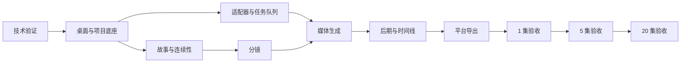

# AI 短视频漫剧工作站实施计划与验收标准

> 文档状态：初稿  
> 对应文档：[PRD](./PRD.md) · [领域模型](./DOMAIN_MODEL.md) · [技术架构](./ARCHITECTURE.md) · [适配器协议](./ADAPTER_PROTOCOL.md)  
> 计划基线：单人开发 + AI 辅助，每周约 30 小时  
> 计划周期：35 周，不包含应用商店审核或第三方平台审批时间  
> 最后更新：2026-07-22

## 1. 计划目标

在 35 周内完成一个可在当前 M3 Pro、18GB 内存的 Mac 上运行的 V1：

- 从故事输入建立可生产故事包。
- 建立角色、场景、声音和导演圣经。
- 将分集剧本转换为分镜并批量生成素材。
- 使用 Grok、CosyVoice3、MuseTalk 和 FFmpeg 完成常规漫剧成片。
- 支持持久任务、自动质检、异常审核和局部返工。
- 导出通用母版、抖音版本和红果版本。
- 依次通过 1 集、连续 5 集和 20 集生产验收。

## 2. 计划假设

### 2.1 人力假设

- 一名开发者负责产品、开发、测试和内容验收。
- AI 可协助编码、测试、文档和结构化内容生成。
- 用户负责模型艺术质量、角色定妆、剧情和粗剪确认。

### 2.2 时间假设

- 每周投入约 30 小时。
- 技术验证失败时优先降级范围，不无限延长首版。
- 真实模型生成时间不计入纯开发工时，但计入阶段验收周期。

### 2.3 范围假设

- 只支持 Apple Silicon macOS。
- 只支持单用户、离线优先项目。
- V1 不自动发布，不提供云同步和公开插件市场。
- 付费 API 保留接口但默认禁用。
- 生成质量由用户判断，不建设艺术质量基准测试集。

## 3. 总体里程碑

| 里程碑 | 周次 | 可衡量产出 | 退出条件 |
|---|---:|---|---|
| M0 技术可行性 | W1–W3 | 8 项技术验证与 ADR | 所有阻断项有可用路线或明确降级 |
| M1 桌面与项目底座 | W4–W7 | 可安装桌面应用、项目库、sidecar、任务队列 | 重启后任务与项目状态可恢复 |
| M2 故事与连续性 | W8–W14 | 事件图谱、Creative Pack、故事包、角色/场景包、状态账本 | 可完成前三个创作确认节点中的前两个 |
| M3 分镜与生成生产线 | W15–W23 | 生产画布、分镜、适配器、资产、依赖图和异常队列 | 单集全部原始素材可生成并追溯 |
| M4 后期与交付 | W24–W31 | TTS、口型、字幕、轻量时间线和平台导出 | 可端到端完成 1 集 |
| M5 连续生产验收 | W32–W35 | 1 集、5 集、20 集验收报告 | 达到目标或形成明确差距与修订计划 |

## 4. 关键依赖路径

最长路径为：技术验证 → 项目底座 → 故事与连续性 → 分镜 → 媒体生成 → 后期 → 导出 → 连续生产验收。

## 5. 阶段 M0：技术可行性验证

### 5.1 目标

在搭建正式业务功能前验证所有高风险外部能力，避免后期才发现核心工具不可用。

### 5.2 任务

| ID | 任务 | 类型 | 预计 | 依赖 |
|---|---|---|---:|---|
| M0-01 | 建立最小 Tauri + React + Rust 工程 | 自动 | 6h | 无 |
| M0-02 | 打包并启动最小 Python sidecar | 自动 | 8h | M0-01 |
| M0-03 | 验证 stdio NDJSON 请求、事件、取消与崩溃恢复 | 自动 | 10h | M0-02 |
| M0-04 | 验证 Codex CLI 非交互结构化输出 | 自动 | 6h | 无 |
| M0-05 | 验证 Grok 文本、图片、编辑和视频文件落盘 | 混合 | 14h | 无 |
| M0-06 | 验证 CosyVoice3 在 M3 Pro 上的安装、TTS 和声音克隆 | 混合 | 12h | 无 |
| M0-07 | 验证 MuseTalk 1.5 MLX 的动漫脸口型、速度和内存 | 混合 | 12h | M0-06 |
| M0-08 | 验证 FFmpeg 竖屏运镜、ASS 字幕、混音和母版渲染 | 自动 | 10h | 无 |
| M0-09 | 验证 `music-downloader` 定向输出、来源采集和 Cookie 权限 | 混合 | 6h | 无 |
| M0-10 | 输出 ADR-001 至 ADR-008 | 自动 | 10h | M0-03～09 |

“混合”表示 AI/代码可执行主要步骤，但需要用户判断媒体质量或确认登录权限。

### 5.3 验收标准

- Tauri 能启动签名路径兼容的 sidecar，并交换 1000 条连续消息无协议污染。
- sidecar 崩溃后可被 Rust 检测并重新启动。
- Codex 至少连续 10 次返回可通过 Schema 校验的样例结果。
- Grok 的每项媒体能力分别得到 `ready`、`degraded` 或 `unavailable` 结论。
- Grok 生成媒体能保存到指定目录并被 FFprobe/图像解码器读取。
- CosyVoice3 能生成普通话并使用授权样本完成声音克隆。
- MuseTalk 能完成至少一个动漫角色近景口型样片，或明确采用简化口型降级。
- FFmpeg 能从测试资产生成 1080×1920、90 秒以内的带字幕混音样片。
- `music-downloader` 不写默认音乐目录，而是写任务暂存目录。
- 8 项 ADR 均记录结论、证据、替代方案和回退路线。

### 5.4 阶段门

以下任一情况必须暂停后续正式开发并调整范围：

- Grok 无法稳定生成并落盘图片。
- 没有可运行的中文 TTS 路线。
- Tauri 无法稳定监督 sidecar。
- FFmpeg 无法在当前设备上完成目标规格渲染。

Grok 视频或 MuseTalk 不可用不阻断 V1，可分别降级为关键帧动态和简化口型。

## 6. 阶段 M1：桌面与项目底座

### 6.1 目标

建立后续所有模块共享的可靠运行环境和项目数据基础。

### 6.2 任务

| ID | 任务 | 类型 | 预计 | 依赖 |
|---|---|---|---:|---|
| M1-01 | 建立 monorepo、格式化、静态检查和测试命令 | 自动 | 6h | M0 |
| M1-02 | 实现 Rust sidecar supervisor 与协议代理 | 自动 | 14h | M0-03 |
| M1-03 | 实现 Python 应用层、领域层和仓储骨架 | 自动 | 10h | M1-01 |
| M1-04 | 实现 global.db 与 project.db 迁移系统 | 自动 | 12h | M1-03 |
| M1-05 | 实现项目创建、打开、关闭和最近项目 | 自动 | 12h | M1-02、04 |
| M1-06 | 实现项目目录、相对路径和文件完整性基础 | 自动 | 12h | M1-05 |
| M1-07 | 实现 `.env.local`、全局 env 和进程环境合并 | 自动 | 8h | M1-05 |
| M1-08 | 实现持久任务队列、租约、重试、暂停和取消 | 自动 | 20h | M1-04 |
| M1-09 | 实现本地日志、脱敏和诊断包基础 | 自动 | 8h | M1-02、07 |
| M1-10 | 建立主导航、项目总览和任务中心壳 | 自动 | 16h | M1-05、08 |
| M1-11 | 实现轻量快照和迁移前备份 | 自动 | 8h | M1-04、06 |

### 6.3 验收标准

- 应用可创建、移动并重新打开项目。
- `project.db` 不包含项目内部绝对路径。
- Python 是项目数据库唯一写入者。
- 应用强制退出后，已入队任务仍存在。
- 过期 `running` 任务能够安全回收。
- 任务支持暂停、恢复、取消和有限重试。
- 项目环境覆盖全局环境，秘密不出现在日志和快照中。
- 用户未确认时，系统不会删除任何文件。
- 项目总览能够显示队列、失败项、磁盘和最近快照。

## 7. 阶段 M2：故事、圣经与连续性

### 7.1 目标

完成“任意成熟度故事输入 → 可生产故事包 → 定妆”的创作闭环。

### 7.2 任务

| ID | 任务 | 类型 | 预计 | 依赖 |
|---|---|---|---:|---|
| M2-01 | 实现故事来源导入与原文保存 | 自动 | 8h | M1 |
| M2-02 | 实现章节切分、事件图谱与来源定位 | 自动 | 14h | M2-01 |
| M2-03 | 实现 Creative Pack 注册、组合、版本锁定和评测 | 自动 | 16h | M1 |
| M2-04 | 实现故事分支与单生产主线 | 自动 | 10h | M2-02 |
| M2-05 | 实现草稿、Schema 校验和正式修订 | 自动 | 14h | M2-02 |
| M2-06 | 实现统一的“规划 → 执行 → 审阅”AI 生成流水线 | 自动 | 16h | M2-03、05、M0-04 |
| M2-07 | 实现故事包、世界规则和整季时间线 | 自动 | 18h | M2-06 |
| M2-08 | 实现分集、场景、台词和钩子编辑 | 自动 | 18h | M2-07 |
| M2-09 | 实现角色、关系和声音档案 | 自动 | 14h | M2-07 |
| M2-10 | 实现角色身份包与定妆候选 | 混合 | 16h | M2-03、09、M0-05 |
| M2-11 | 实现场景包、空间关系和道具 | 自动 | 14h | M2-03、07 |
| M2-12 | 实现时间化状态账本和冲突检查 | 自动 | 18h | M2-08、09、11 |
| M2-13 | 实现视觉圣经与导演预设三级继承 | 自动 | 16h | M2-03、09、11 |
| M2-14 | 实现故事包和定妆确认门 | 自动 | 10h | M2-07、10、11、13 |
| M2-15 | 用户创建并确认首个试验项目故事包 | 手动 | 6h | M2-14 |

M2-02 将长文本切分为可追溯片段，事件必须保存原文章节、文本范围和参与对象；后续 AI 生成引用来源事实时必须使用可定位来源，创作性补充必须明确标记。M2-03 的 Creative Pack 按视觉风格、叙事题材和模型技法组合，项目锁定具体修订与内容哈希，评测结果不得自动覆盖已确认版本。M2-06 要求所有 AI 生成先输出计划，再由专项执行器生成草稿，最后由隔离调用的独立审阅器给出结构化问题；任何阶段都不能绕过 Schema 校验和确认门。M2-10 先复用 M0 已验证的 Grok 图片 wrapper 完成定妆；M3 再将其升级为正式 AWAP 生产适配器。

### 7.3 验收标准

- 一句话创意、小说文本和已有分集剧本均可创建故事来源。
- 长文本可稳定切分，任一事件均可定位到原文章节和文本范围。
- 事件图谱能够表达事件顺序、参与角色、涉及场景/道具和因果或依赖关系。
- Creative Pack 可按视觉风格、叙事题材和模型技法组合，项目锁定的修订与哈希可复现同一规则集合。
- Creative Pack 具备固定样例评测，规则冲突、缺失资源或评测退化会阻止新版本成为默认版本。
- 每次 AI 生成均保存计划、执行结果和独立审阅结果；审阅未通过时只能进入修改或人工确认，不能自动成为正式版本。
- AI 输出不会绕过草稿与 Schema 校验直接成为正式版本。
- 同一项目只能有一个生产主线。
- 可创建 20 集以上的结构化故事包样本。
- 主要角色身份包包含多视角、景别、表情、服装和声音档案。
- 核心场景包含空间布局、机位、昼夜和关键道具。
- 状态账本可检测服装、伤病、道具持有等时间冲突。
- 故事包与定妆确认后，修改目标版本会使原确认失效。

## 8. 阶段 M3：分镜与素材生产线

### 8.1 目标

把已确认剧本转换为可批量执行、可追溯、可局部返工的镜头生产计划。

### 8.2 任务

| ID | 任务 | 类型 | 预计 | 依赖 |
|---|---|---|---:|---|
| M3-01 | 实现 AWAP Schema、SDK 和协议合规测试骨架 | 自动 | 16h | M1 |
| M3-02 | 实现能力目录、安装发现和探测 | 自动 | 14h | M3-01 |
| M3-03 | 实现路由策略、费用分类和预算门禁 | 自动 | 12h | M3-02 |
| M3-04 | 实现 Codex 与 Grok 文本适配器 | 自动 | 16h | M3-01、M0 |
| M3-05 | 实现 Grok 图片与图片编辑适配器 | 混合 | 20h | M3-02、M0-05 |
| M3-06 | 实现 Grok 图生视频适配器与降级 | 混合 | 18h | M3-05、M0-05 |
| M3-07 | 实现 FFmpeg/FFprobe 受控适配器 | 自动 | 18h | M3-01、M0-08 |
| M3-08 | 实现资产、文件、候选集和来源记录 | 自动 | 16h | M1、M3-01 |
| M3-09 | 构建单集生产画布原型并验证 30 镜头操作效率 | 混合 | 20h | M1-10、M2-08 |
| M3-10 | 实现分镜、镜头、连续性快照和导演规则 | 自动 | 22h | M2-12、13、M3-04、09 |
| M3-11 | 实现分镜与台词确认门 | 自动 | 8h | M3-10 |
| M3-12 | 实现生产项、生成清单和输入指纹 | 自动 | 16h | M3-05、08、10 |
| M3-13 | 实现依赖图、影响分析和 `stale` 传播 | 自动 | 20h | M3-12 |
| M3-14 | 实现自动质检规则和异常审核队列 | 自动 | 18h | M3-07、08、12 |
| M3-15 | 实现资产检索、复用和重复度提示 | 自动 | 16h | M3-08、10 |
| M3-16 | 完成单集 18～30 镜头素材生成演练 | 混合 | 8h | M3-05～15 |

M3-09 限时 2～3 个开发日，只验证单集生产交互，不承担正式工作流或依赖计算。原型使用固定的 30 镜头数据集，覆盖剧本、参考资产、生成候选、任务状态和异常标记，并记录完成镜头定位、批量选择、资产替换、异常跳转和镜头重排所需的操作次数与时间。候选布局需让五项基准任务的中位完成时间或操作步数至少一项较列表基线改善 20%，且无阻断性误操作；否则采用列表/分栏基线。原型结论必须明确正式实现采用画布、列表/分栏或混合布局，不得因沉没成本保留画布方案。

### 8.3 验收标准

- 新适配器不修改故事领域代码即可注册能力。
- Grok 文本、图片和视频分别显示探测状态。
- 未知费用或未授权付费能力不能启动进程。
- 单集生产原型可完整呈现 30 个镜头及其资产、候选、任务和异常状态。
- 用户能在不打开超过两个层级页面的情况下完成镜头定位、批量选择、资产替换、异常跳转和镜头重排；原型评测记录操作时间、步骤数和主要误操作。
- 候选布局的五项基准任务中位完成时间或操作步数至少一项较列表基线改善 20%，且无阻断性误操作；未达标时正式实现采用列表/分栏基线。
- 画布只作为领域数据视图，不保存独立业务真相，不直接计算正式依赖关系或绕过后端命令。
- 单集分镜能生成 18～30 个镜头并通过确认门。
- 每个生产项都保存输入指纹、工具、参数和输出。
- 普通镜头默认只创建一个候选。
- 上游修改只标记实际依赖的生产项与下游为过期。
- 锁定资产不会被自动替换。
- 异常进入审核队列，系统不会无限自动重生成。
- 关闭并重开应用后，可继续未完成的单集素材批次。

## 9. 阶段 M4：声音、后期与平台交付

### 9.1 目标

把镜头素材组装成带配音、口型、字幕、音乐音效的可发布成片。

### 9.2 任务

| ID | 任务 | 类型 | 预计 | 依赖 |
|---|---|---|---:|---|
| M4-01 | 实现 CosyVoice3 组件管理和 AWAP 适配器 | 混合 | 20h | M0-06、M3-01 |
| M4-02 | 实现声音授权记录、角色声音与逐句 TTS | 自动 | 14h | M2-09、M4-01 |
| M4-03 | 实现 MuseTalk MLX 适配器和分级口型 | 混合 | 20h | M0-07、M4-02 |
| M4-04 | 实现字幕段、ASS 编译和安全区预览 | 自动 | 16h | M2-08、M3-07、M4-02 |
| M4-05 | 实现 `music-downloader` 适配器 | 自动 | 10h | M0-09、M3-01 |
| M4-06 | 实现音乐/音效素材库和人工确认 | 自动 | 12h | M3-08、M4-05 |
| M4-07 | 实现非破坏性时间线数据与编辑命令 | 自动 | 24h | M3-08、10 |
| M4-08 | 实现代理、缩略图、波形和轻量预览 | 自动 | 16h | M3-07、M4-07 |
| M4-09 | 实现对白、音乐、音效混音计划 | 自动 | 14h | M4-02、06、07 |
| M4-10 | 实现 FFmpeg 时间线编译与粗剪渲染 | 自动 | 24h | M4-04、08、09 |
| M4-11 | 实现粗剪确认门与局部重渲染 | 自动 | 12h | M4-10、M3-13 |
| M4-12 | 实现封面模板、标题和发布清单 | 自动 | 12h | M4-11 |
| M4-13 | 实现母版、抖音和红果导出配置 | 自动 | 16h | M4-10、11 |
| M4-14 | 完成 1 集端到端试播集 | 混合 | 12h | M4-01～13 |

### 9.3 验收标准

- TTS 和声音克隆必须有授权状态，缺失时阻断任务。
- 近景/特写可用精确口型，其他镜头按分级策略处理。
- 字幕与配音片段同步，竖屏安全区预览正确。
- 下载音乐和音效先进入待确认，用户确认后才可用于母版。
- 时间线所有操作均为非破坏性。
- 代理预览和最终渲染使用同一时间线语义。
- 单镜头或台词修改只重渲染受影响部分和下游成片。
- 可导出无平台水印母版、抖音版本和红果版本。
- 试播集时长 90～120 秒，包含配音、字幕、音乐音效和封面。

## 10. 阶段 M5：连续生产验收

### 10.1 目标

验证系统不是只能完成演示，而是可以支持连续剧长期生产。

### 10.2 验收 1：试播集

#### 输入

- 已确认故事包。
- 已确认角色与核心场景。
- 一集已确认分镜与台词。

#### 必须通过

- 从分镜到三种成片导出完整跑通。
- 所有已用资产均有来源或生成清单。
- 无待确认音乐进入母版。
- 任一镜头可定位其角色、场景、状态和生成参数。
- 应用重启不会破坏项目。

#### 人工评价

- 角色是否可接受。
- 配音、口型和字幕是否自然。
- 节奏与导演语言是否符合预期。
- 是否达到可发布水平。

### 10.3 验收 2：连续 5 集

#### 必须通过

- 角色脸、服装、声音和场景在 5 集内保持可接受一致。
- 状态账本正确应用至少 3 次跨集变化。
- 至少一次修改上游剧情并完成局部返工。
- 批量任务失败不会阻塞其他集。
- 审核主要集中在异常项，而不是每个镜头强制操作。
- 资产复用不会造成明显连续镜头重复。

#### 记录指标

- 每集镜头数。
- 每集生成尝试数和失败数。
- 每集人工操作时间。
- 单集磁盘增长。
- 每个适配器平均耗时与主要错误。
- 局部返工实际影响数量。

### 10.4 验收 3：20 集生产

#### 目标指标

- 在稳定流程下，单日完成约 5 集。
- 每天人工操作时间控制在 1～2 小时。
- 20 集均可生成母版、抖音和红果版本。
- 无项目数据库损坏、任务丢失或源素材覆盖。
- 所有文件删除均由用户人工发起。

#### 结果判定

| 等级 | 条件 | 后续动作 |
|---|---|---|
| 通过 | 主要目标达成，无阻断缺陷 | 扩展到 50～80 集 |
| 有条件通过 | 成片可用，但产能或人工时间偏差不超过 30% | 优化瓶颈后扩展 |
| 未通过 | 无法连续生产、数据不可靠或偏差超过 30% | 返回对应里程碑修订 |

## 11. 优先级与范围控制

### 11.1 P0：V1 必须完成

- 项目、版本、任务、资产和依赖基础。
- 章节事件图谱、Creative Pack、AI 规划—执行—审阅流水线。
- 故事包、角色/场景包和状态账本。
- 分镜、Grok 图片、TTS、字幕和 FFmpeg 成片。
- 持久队列、异常审核、局部返工。
- 通用母版、抖音与红果导出。
- 音乐/音效获取、入库和人工确认。

### 11.2 P1：有降级路线

- Grok 图生视频：降级为关键帧动态。
- MuseTalk 精确口型：降级为简化口型。
- AI 视觉质检：降级为确定性检查 + 人工审核。
- 全局资产硬链接：降级为复制。
- 自动组件安装：降级为引导式手动安装。

### 11.3 P2：V1 延后

- 全功能专业剪辑器。
- 自动发布。
- 多用户和云同步。
- Windows。
- 多语言与方言正式工作流。
- 公开插件市场。
- 自动艺术质量评分。

## 12. 缺陷优先级

| 级别 | 定义 | 处理规则 |
|---|---|---|
| S0 | 数据丢失、秘密泄露、未经授权付费或删除文件 | 立即停止阶段验收 |
| S1 | 主流程无法继续且无安全绕过 | 当前阶段必须修复 |
| S2 | 功能错误但有明确绕过 | 阶段结束前评估，优先修复 |
| S3 | 体验、样式或低频问题 | 进入后续迭代 |

任何 S0、未解决 S1 都会阻止里程碑通过。

## 13. 每周节奏

### 周初

- 选择本周阶段目标。
- 确认最多 3 个关键交付物。
- 检查上周未解决阻断项。
- 更新风险和范围降级决定。

### 每日

- 优先推进关键依赖路径。
- 每个任务完成后运行相关测试。
- 记录技术验证证据和关键决策。
- 发现范围外需求时进入待办，不直接插入开发。

### 周末

- 演示可运行增量。
- 核对里程碑验收项。
- 更新完成工时、偏差和下周计划。
- 创建轻量项目快照和文档更新。

## 14. 任务完成定义

一个开发任务只有同时满足以下条件才算完成：

1. 代码已实现并符合当前架构边界。
2. 相关单元或集成测试通过。
3. 错误路径和取消路径已验证。
4. 没有秘密或绝对项目路径写入日志/数据库。
5. 对外协议或 Schema 变化已更新文档。
6. 可在当前 M3 Pro 设备上演示。
7. 未留下未记录的手工步骤。

## 15. 风险登记

| 风险 | 概率 | 影响 | 触发信号 | 应对 |
|---|---|---|---|---|
| Grok 媒体 CLI 不稳定 | 高 | 高 | 能力不可探测或无法定向落盘 | 优先图片，视频降级；保持适配器可替换 |
| CosyVoice3/MuseTalk 内存冲突 | 中 | 高 | 峰值内存导致换页或崩溃 | 模型不并发常驻，串行本地重任务 |
| Tauri + Python 打包复杂 | 中 | 高 | 开发可用但签名包不可运行 | W1 即验证正式打包路径 |
| 单人范围过大 | 高 | 高 | 连续两周计划完成率低于 70% | 优先 P0，立即启用 P1 降级 |
| UI 时间线耗时超预期 | 中 | 中 | W28 仍无法稳定预览 | 限制 V1 编辑操作，优先模板化时间线 |
| Creative Pack 规则冲突或评测退化 | 中 | 中 | 相同输入在升级后出现结构或风格明显漂移 | 锁定修订与哈希，升级前运行固定样例评测并要求人工确认 |
| 单集生产画布交互收益不足 | 中 | 中 | 30 镜头测试中操作步骤或误操作高于列表/分栏基线 | 将原型限制在 2～3 天，按评测结果选择画布、列表/分栏或混合布局 |
| 外部 CLI 改版 | 高 | 中 | 探测或输出解析突然失败 | 健康检查、标准错误和适配器版本隔离 |
| 媒体文件占满磁盘 | 中 | 高 | 预计空间不足完成当前批次 | 外置 SSD、代理、批次前预估、人工清理 |
| 人工审核超过 2 小时 | 高 | 高 | 5 集验收平均超目标 | 单候选、批量审核、异常队列和资产复用 |
| 音乐来源争议 | 中 | 高 | 素材无来源或未确认 | 来源记录、待确认状态和发布硬门禁 |

## 16. 计划变更规则

- 里程碑范围变化必须更新本文及相关 PRD。
- 核心架构变化需要新增或修订 ADR。
- 影响协议兼容的变化必须更新 AWAP 版本。
- 计划偏差超过一周时，不通过压缩测试追回；优先删减 P1/P2。
- 任一阶段发现 S0 风险时，暂停新功能并先修复风险。
- 用户可随时调整投入时间，周次按实际可用工时同比平移。

## 17. 交付物清单

### M0

- 技术验证代码。
- 8 份 ADR。
- 设备性能记录。
- 能力可用性矩阵。

### M1

- 可安装桌面壳。
- 项目与任务底座。
- 数据库迁移与快照。
- 日志和诊断基础。

### M2

- 故事工作台。
- 章节事件图谱与来源定位。
- Creative Pack 注册表、组合规则、锁定版本和评测报告。
- 规划、执行与审阅记录可追溯的 AI 生成流水线。
- 可生产故事包。
- 角色/场景/声音圣经。
- 连续性状态账本。

### M3

- AWAP SDK 与内置适配器。
- 30 镜头单集生产画布原型与交互评测结论。
- 分镜与素材生产线。
- 依赖图、候选和审核队列。

### M4

- 声音、口型、字幕、音乐音效。
- 轻量时间线和粗剪。
- 母版与平台导出。

### M5

- 试播集。
- 连续 5 集样片。
- 20 集生产验收报告。
- 50～80 集扩展决定。

## 18. 下一步启动清单

计划确认后，按以下顺序启动：

1. 初始化 Git 仓库和工程目录。
2. 创建 M0 技术验证分支或工作区。
3. 搭建最小 Tauri + React 应用。
4. 搭建最小 Python sidecar。
5. 完成 ADR-001 的 stdio NDJSON 验证。
6. 并行验证 Grok、CosyVoice3、MuseTalk 和 FFmpeg。
7. 在 W3 末进行 M0 阶段门评审。
